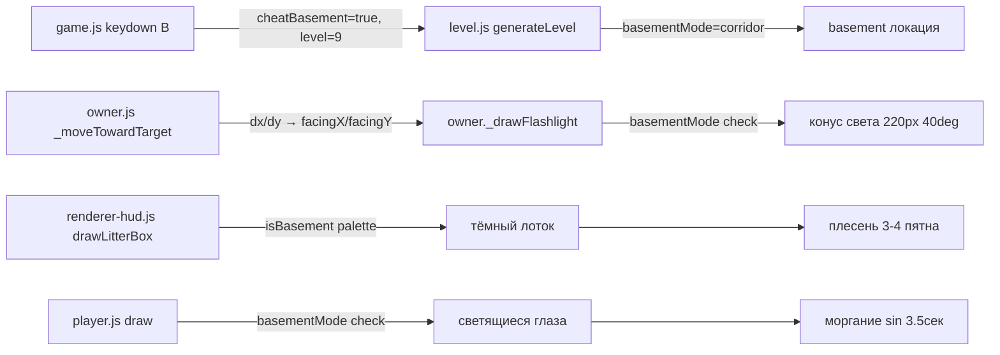

# 🏚️ План: дизайн подвала

## Исправления

### Баг: горизонтальные стены в corridor-режиме перекрывали правый край (col 29)

**Симптом:** В лайт-подвале (corridor) горизонтальные стены доходили до col 29 (правый край экрана), не оставляя прохода. Боковой код (side-wall) пытался поставить вертикальные стены на col 29, но ячейки уже были заняты горизонтальными стенами → `_makeWallObstacle` возвращал `false` → проход не создавался.

**Исправление (`js/level.js`, `generateCorridorMaze()`):**
Горизонтальные стены теперь занимают только cols **1..28** (`wallStart=1`, `wallEnd=GRID_COLS-1=29`). Col 0 и col 29 остаются свободными для кода боковых стен, который гарантирует проход шириной 2 ячейки в каждой секции.

---


## Задачи

1. Чит-код для быстрого перехода в подвал
2. Тёмный лоток + плесень в подвале
3. Фонарик у хозяина (конус света по направлению движения)
4. Светящиеся глаза кота в темноте подвала

---

## 1. Чит-код для перехода в подвал

### Файлы: `js/game.js`, `js/level.js`, `js/renderer-hud.js`

### Механика
- Нажатие `B` на стартовом экране → форсирует подвал при старте
- Нажатие `B` во время игры → немедленно переходит в подвал (без сброса счёта/жизней)
- Флаг `cheatBasement = false` в `js/level.js` — при `true` форсирует `basementMode = "corridor"` и `currentLocation = basement`

### Изменения в `js/level.js`
```js
// Добавить глобальный флаг (рядом с basementMode)
let cheatBasement = false;

// В generateLevel(), блок выбора локации — ПЕРЕД обычной логикой:
if (cheatBasement) {
  currentLocation = locationThemes.find(t => t.key === "basement");
  basementMode = "corridor";
  cheatBasement = false; // сбрасываем после использования
} else if (level >= BASEMENT.dfsMinLevel && rng() < BASEMENT.dfsProb) {
  // ... существующая логика
```

### Изменения в `js/game.js`
```js
// e.key === "B" — латинская заглавная B (Shift+B при английской раскладке).
// При русской раскладке Shift+B даёт "И" — чит не сработает, нужна EN-раскладка.
// Нижний регистр "b" намеренно НЕ обрабатывается — защита от случайного нажатия.

// В keydown, блок gameState === "start":
if (e.key === "B") {
  cheatBasement = true;
  level = 9; // минимальный уровень для подвала
  startGame();
}

// В keydown, блок gameState === "playing":
if (e.key === "B") {
  cheatBasement = true;
  level = Math.max(level, 9);
  generateLevel();
  owner.activate();
  levelMessageTimer = 180;
}
```

### Изменения в `js/renderer-hud.js`
```js
// В drawStartScreen(), после подсказки с клавишами (~строка 298):
setFont("13px Arial"); ctx.fillStyle = "rgba(255,200,80,0.55)";
ctx.fillText("[Shift+B] — 🏚️ Подвал (чит)", WORLD.width/2, 672);
```

---

## 2. Тёмный лоток + плесень в подвале

### Файл: `js/renderer-hud.js` — функция `drawLitterBox()`

### Текущие цвета (светлые, выбиваются):
- Корпус: `#7a5520`
- Ободок: `#a0692a`
- Наполнитель: `#d9b87a` ← главная проблема
- Блик ободка: `rgba(255,220,150,0.28)`

### Новые цвета для подвала:
- Корпус: `#1e1510` (почти чёрный)
- Ободок: `#2e2018`
- Наполнитель: `#3a2e1e` (тёмная земля/грязь)
- Блик ободка: убрать (нет глянца в подвале)
- Точки текстуры: `rgba(15,10,5,0.6)`
- Подпись: `rgba(160,140,100,0.65)`

### Плесень (только в подвале):
```js
if (currentLocation.key === "basement") {
  // 3-4 пятна плесени на корпусе лотка
  const moldSpots = [
    { rx: lw * 0.15, ry: lh * 0.4, rx2: 7, ry2: 4, rot: 0.3 },
    { rx: lw * 0.7,  ry: lh * 0.6, rx2: 5, ry2: 3, rot: -0.5 },
    { rx: lw * 0.45, ry: lh * 0.75, rx2: 8, ry2: 3, rot: 0.8 },
    { rx: lw * 0.85, ry: lh * 0.35, rx2: 4, ry2: 4, rot: 0.1 },
  ];
  ctx.fillStyle = "rgba(35,65,25,0.60)";
  for (const m of moldSpots) {
    ctx.save();
    ctx.translate(lx + m.rx, ly + 10 + m.ry);
    ctx.rotate(m.rot);
    ctx.beginPath();
    ctx.ellipse(0, 0, m.rx2, m.ry2, 0, 0, Math.PI * 2);
    ctx.fill();
    ctx.restore();
  }
  // Маленькие точки плесени
  ctx.fillStyle = "rgba(50,90,30,0.45)";
  [[lw*0.25, lh*0.5], [lw*0.6, lh*0.3], [lw*0.8, lh*0.65]].forEach(([rx, ry]) => {
    ctx.beginPath();
    ctx.arc(lx + rx, ly + 10 + ry, 2.5, 0, Math.PI * 2);
    ctx.fill();
  });
}
```

### Реализация через палитру:
```js
const isBasement = currentLocation.key === "basement";
const bodyColor   = isBasement ? "#1e1510" : "#7a5520";
const rimColor    = isBasement ? "#2e2018" : "#a0692a";
const sandColor   = isBasement ? "#3a2e1e" : "#d9b87a";
const rimShine    = isBasement ? null : "rgba(255,220,150,0.28)";
const labelColor  = isBasement ? "rgba(160,140,100,0.65)" : "#4a2800";
```

---

## 3. Фонарик у хозяина

### Файлы: `js/owner.js`

### Новые поля объекта `owner`:
```js
facingX: 1,   // направление взгляда (нормализованный вектор)
facingY: 0,
```

### Обновление направления в `_moveTowardTarget()`:
```js
// После вычисления dx, dy (нормализованных) — перед применением движения:
if (Math.abs(dx) > 0.01 || Math.abs(dy) > 0.01) {
  this.facingX = dx;
  this.facingY = dy;
}
```

### Метод `_drawFlashlight()` в `owner`:
```js
_drawFlashlight() {
  if (basementMode === "") return; // только в подвале

  const cx = this.x + this.width / 2;
  const cy = this.y + this.height / 2;
  const angle = Math.atan2(this.facingY, this.facingX);
  const coneAngle = Math.PI / 4.5; // ~40° полуугол
  const coneLen = 220;

  ctx.save();

  // Конус света — радиальный градиент
  const grad = ctx.createRadialGradient(cx, cy, 8, cx, cy, coneLen);
  grad.addColorStop(0,   "rgba(255,230,140,0.42)");
  grad.addColorStop(0.4, "rgba(255,210,100,0.22)");
  grad.addColorStop(1,   "rgba(255,190,60,0)");

  ctx.fillStyle = grad;
  ctx.beginPath();
  ctx.moveTo(cx, cy);
  ctx.arc(cx, cy, coneLen, angle - coneAngle, angle + coneAngle);
  ctx.closePath();
  ctx.fill();

  // Маленький кружок — сам фонарик (источник)
  ctx.fillStyle = "rgba(255,240,180,0.75)";
  ctx.beginPath();
  ctx.arc(
    cx + this.facingX * (this.width / 2 + 2),
    cy + this.facingY * (this.height / 2 + 2),
    5, 0, Math.PI * 2
  );
  ctx.fill();

  ctx.restore();
},
```

### Вызов в `draw()` — ДО рисования спрайта:
```js
draw() {
  if (!this.active) return;
  this._drawFlashlight(); // конус рисуется под спрайтом
  // ... остальной код draw()
```

---

## 4. Светящиеся глаза кота

### Файл: `js/player.js` — метод `draw()`

### Механика:
- Только в подвале (`basementMode !== ""`)
- Два жёлто-зелёных эллипса с `shadowBlur`
- Моргание: `Math.sin(_now * 0.0018) > 0.96` → глаза закрыты (~раз в 3.5 сек)
- Позиция: относительно `this.x / this.y` с учётом размера кота (36×36)

### Код (добавить в конец `draw()`, перед `ctx.restore()`):
```js
// Светящиеся глаза в подвале
if (basementMode !== "") {
  const blinking = Math.sin(_now * 0.0018) > 0.96;
  if (!blinking) {
    ctx.save();
    ctx.shadowColor = "rgba(180,255,80,0.9)";
    ctx.shadowBlur = 8;
    ctx.fillStyle = "rgba(200,255,100,0.92)";
    // Левый глаз
    ctx.beginPath();
    ctx.ellipse(
      this.x + this.size * 0.32,
      this.y + this.size * 0.38,
      3.5, 2.5, 0, 0, Math.PI * 2
    );
    ctx.fill();
    // Правый глаз
    ctx.beginPath();
    ctx.ellipse(
      this.x + this.size * 0.68,
      this.y + this.size * 0.38,
      3.5, 2.5, 0, 0, Math.PI * 2
    );
    ctx.fill();
    ctx.restore();
  }
}
```

---

## Диаграмма изменений



---

## Порядок реализации

1. `js/level.js` — добавить `cheatBasement` флаг + логику в `generateLevel()`
2. `js/game.js` — обработчик `B` в keydown для старта и в игре
3. `js/renderer-hud.js` — тёмный лоток + плесень + подсказка `[B]`
4. `js/owner.js` — `facingX/facingY` + `_drawFlashlight()` + вызов в `draw()`
5. `js/player.js` — светящиеся глаза

## Тесты

- Добавить тест: `cheatBasement = true` → `generateLevel()` → `currentLocation.key === "basement"`
- Добавить тест: `owner.facingX/facingY` обновляются при движении
- Тест на `drawLitterBox` не нужен (чисто визуальный)
- Тест на глаза кота не нужен (чисто визуальный)
