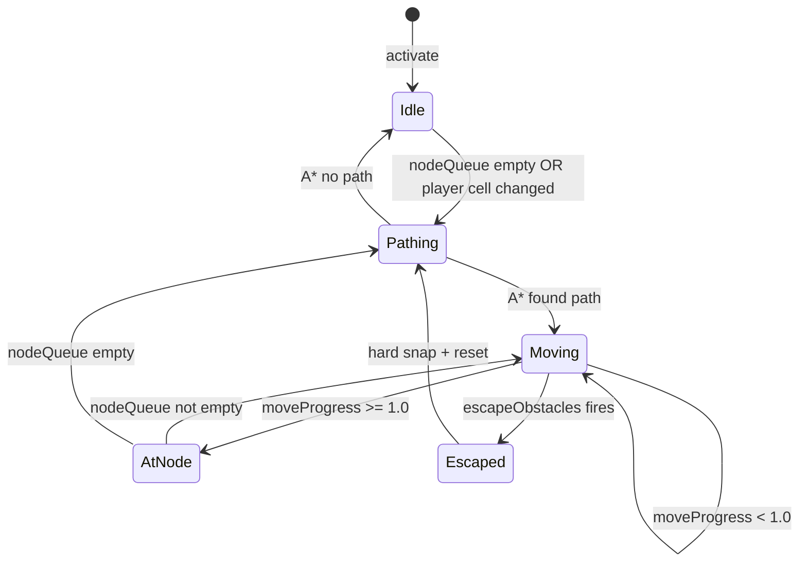
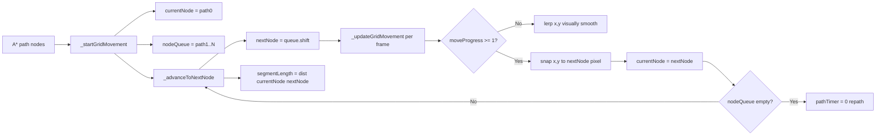

# 🎯 Grid-Node Movement Plan v2 — Tile-Based Owner Navigation (Basement Only)

> **Парадигма**: переход от `continuous steering controller` к `discrete tile locomotion + visual interpolation`.
> Это не фикс симптома — это устранение источника нестабильности.

---

## 🔬 Root Cause: Почему текущий steering замерзает

### Точная диагностика (из debug-лога)

```
ownerX=259.9  ownerY=410.0  targetX=277.9  axisY=430  [ADVANCING]
ownerX=259.9  ownerY=413.6  targetX=277.9  axisY=430  [ADVANCING]
ownerX=259.9  ownerY=410.0  ...  ← вернулся! бесконечная осцилляция
```

**Точные числа:**
- `ownerCx = 259.9 + 18 = 277.9` (центр)
- `ownerCy = 410.0 + 18 = 428.0` (центр)
- `axisY = 430` (центр коридора)
- `perpDist = 430 - 428 = 2px` = **ровно** `ALIGN_THRESHOLD`

**Условие** `Math.abs(perpDist) > ALIGN_THRESHOLD` — строгое (`>`), поэтому при ровно 2px → ADVANCING.
ADVANCING возвращает цель `{x: 277.9, y: 430}`. Хозяин движется к Y=430.
После одного кадра при speed≈3.6px: `ownerY = 413.6`, `ownerCy = 431.6`, `perpDist = -1.6px < 2` → снова ADVANCING.
Хозяин перелетает обратно. **Бесконечная осцилляция на границе порога.**

### Почему все предыдущие фиксы не помогли

Каждый фикс (ALIGN_THRESHOLD, EPSILON, snap-to-cell, net-displacement) лечит симптом.
**Корень проблемы архитектурный:**

> Continuous steering пытается одновременно двигаться вдоль оси И корректировать перпендикулярное смещение через единый нормализованный вектор. Вблизи граничного значения порога floating-point арифметика создаёт осцилляцию, которую никакое значение порога не устранит.

Стена справа (`xOk=false`) блокирует X-движение → движется только Y → Y осциллирует → `netDist2=0` → stuck detection → repath → тот же путь → та же осцилляция. **Бесконечный цикл.**

---

## 🏗️ Архитектурное решение: Tile-Based (Pac-Man) Movement

### Смена парадигмы

| Было | Стало |
|------|-------|
| `movement state == render state` | `logical node state + visual interpolation state` |
| Хозяин «пытается двигаться» | Хозяин **гарантированно** переходит из node A в node B |
| AI думает в пикселях | **AI думает в ячейках, физика рендерит в пикселях** |
| Continuous steering + wall sliding + centering + thresholds | Дискретное движение по узлам + lerp для визуала |

### Что убирается полностью (в подвале)

- `ALIGN_THRESHOLD` — не нужен, нет perpendicular offset
- `EPSILON` — не нужен, прогресс 0→1 без граничных случаев
- `perpDist` / centering — не нужен, хозяин всегда на оси
- `_compressToSegments` / `pathSegments` / `segmentIndex` — заменяется `nodeQueue`
- `_getSteeringTarget` — заменяется `_updateGridMovement`
- wall sliding в basement — не нужен, движение по свободным ячейкам A*
- `escapeObstacles` в basement — заменяется hard snap + repath

### Что остаётся без изменений (открытые уровни)

Весь существующий continuous steering код остаётся для `basementMode === ""`.
Никаких изменений в поведении на открытых уровнях.

---

## 📐 Детальная архитектура

### Новые поля состояния (добавляются в объект `owner`)

```javascript
// Grid-node movement (только в подвале)
currentNode: null,   // {col, row} — узел, из которого движемся
nextNode: null,      // {col, row} — узел, к которому движемся
moveProgress: 0,     // 0.0 → 1.0, прогресс между currentNode и nextNode
nodeQueue: [],       // [{col, row}, ...] — оставшиеся узлы A* пути
```

### Ключевые инварианты после реализации

1. В basement `owner.x/y` — всегда либо точный `cellToPixel(currentNode)`, либо линейная интерполяция между двумя соседними ячейками
2. `moveProgress` — **монотонно возрастает**, никогда не осциллирует
3. `currentNode` и `nextNode` — всегда соседние узлы A* (отличаются ровно на 1 по col ИЛИ row)
4. Нет `ALIGN_THRESHOLD`, нет `EPSILON`, нет `perpDist` — эти концепции не существуют в новой модели

---

## ⚠️ Критические замечания из review (учтены в плане)

### 1. Проблема телепорта при repath mid-transition

**Проблема**: при repath во время движения между узлами `path[0]` может быть не той ячейкой, где визуально находится хозяин → микротелепорт.

**Решение**: repath разрешён **только при прибытии в узел** (`moveProgress >= 1.0`).
Исключение: форсированный repath (escapeObstacles) → hard snap к ближайшему свободному узлу + сброс.

```
repath triggers:
  ✅ nodeQueue exhausted (path[0] arrived, queue empty)
  ✅ pathTimer fired AND moveProgress >= 1.0 (arrived at node)
  ✅ escapeObstacles fired → hard snap + immediate repath
  ❌ mid-transition repath (запрещён — вызывает телепорт)
```

### 2. Частота repath — только по событиям, не по таймеру

**Проблема**: repath каждые 15 кадров создаёт state churn и микродёргания.

**Решение**: repath только по событиям:
- `nodeQueue` исчерпан (путь пройден)
- Игрок перешёл в другую ячейку (цель изменилась)
- `escapeObstacles` сработал
- Путь не найден (A* вернул null)

Таймер `pathTimer` остаётся как fallback (каждые 30 кадров в basement), но основной триггер — события.

### 3. Длина сегмента — вычислять явно, не предполагать GRID

**Проблема**: `moveProgress += spd / GRID` предполагает, что расстояние между узлами всегда 40px. Это true сейчас, но сломается при smoothing/jump links.

**Решение**: вычислять `segmentLength` явно:

```javascript
// При установке nextNode:
const fromPx = cellToPixel(this.currentNode.col, this.currentNode.row);
const toPx   = cellToPixel(this.nextNode.col,    this.nextNode.row);
const dx = toPx.x - fromPx.x, dy = toPx.y - fromPx.y;
this.segmentLength = Math.sqrt(dx*dx + dy*dy); // обычно 40px, но future-proof

// В _updateGridMovement:
this.moveProgress += spd / this.segmentLength;
```

### 4. Не тащить continuous physics в дискретный maze

**Проблема**: если оставить wall sliding и escapeObstacles в basement, они вернут oscillation hell в другой форме.

**Решение**: в basement:
- **Нет wall sliding** — движение по свободным ячейкам A*, стены не могут блокировать
- **Нет centering** — хозяин всегда на оси между двумя узлами
- **escapeObstacles** → hard snap к ближайшему свободному узлу + repath (не continuous escape)

---

## 🔧 Пошаговый план реализации

### Шаг 1: Новые поля в объекте `owner`

В [`js/owner.js`](js/owner.js) добавить в объект `owner`:

```javascript
// Grid-node movement (basement only)
currentNode: null,
nextNode: null,
moveProgress: 0,
segmentLength: GRID,  // px между currentNode и nextNode (обычно 40)
nodeQueue: [],
lastPlayerCell: null, // для детекции смены ячейки игрока
```

### Шаг 2: Метод `_startGridMovement(path)`

Заменяет `_compressToSegments`. Вызывается когда A* возвращает новый путь в basement.

```javascript
_startGridMovement(path) {
  if (!path || path.length < 2) {
    this.nodeQueue = [];
    this.nextNode = null;
    return;
  }
  // Snap к первому узлу пути (только при старте или после escape)
  this.currentNode = path[0];
  const px = cellToPixel(this.currentNode.col, this.currentNode.row);
  this.x = px.x;
  this.y = px.y;
  this.moveProgress = 0;
  // Очередь = остаток пути
  this.nodeQueue = path.slice(1);
  // Начинаем движение к первому узлу очереди
  this._advanceToNextNode();
},
```

### Шаг 3: Вспомогательный метод `_advanceToNextNode()`

```javascript
_advanceToNextNode() {
  if (this.nodeQueue.length === 0) {
    this.nextNode = null;
    this.segmentLength = GRID;
    return;
  }
  this.nextNode = this.nodeQueue.shift();
  // Вычисляем длину сегмента явно (future-proof)
  const fromPx = cellToPixel(this.currentNode.col, this.currentNode.row);
  const toPx   = cellToPixel(this.nextNode.col,    this.nextNode.row);
  const dx = toPx.x - fromPx.x, dy = toPx.y - fromPx.y;
  this.segmentLength = Math.sqrt(dx*dx + dy*dy) || GRID;
  // Обновляем направление взгляда
  if (dx !== 0 || dy !== 0) {
    const len = this.segmentLength;
    this.facingX = dx / len;
    this.facingY = dy / len;
  }
},
```

### Шаг 4: Метод `_updateGridMovement(spd)`

Вызывается каждый кадр в basement вместо continuous steering.

```javascript
_updateGridMovement(spd) {
  if (!this.currentNode) return;

  if (!this.nextNode) {
    // Путь исчерпан — запрашиваем repath
    this.pathTimer = 0;
    return;
  }

  // Advance progress
  this.moveProgress += spd / this.segmentLength;

  if (this.moveProgress >= 1.0) {
    // Прибыли в nextNode
    this.moveProgress -= 1.0;  // carry-over для плавности
    this.currentNode = this.nextNode;

    // Snap к точному пикселю (устраняет float drift)
    const px = cellToPixel(this.currentNode.col, this.currentNode.row);
    this.x = px.x;
    this.y = px.y;

    // Переходим к следующему узлу
    this._advanceToNextNode();

    // Если очередь исчерпана — repath
    if (!this.nextNode) {
      this.pathTimer = 0;
    }
  } else {
    // Визуальная интерполяция между узлами
    const fromPx = cellToPixel(this.currentNode.col, this.currentNode.row);
    const toPx   = cellToPixel(this.nextNode.col,    this.nextNode.row);
    this.x = fromPx.x + (toPx.x - fromPx.x) * this.moveProgress;
    this.y = fromPx.y + (toPx.y - fromPx.y) * this.moveProgress;
  }
},
```

### Шаг 5: Модификация `_moveTowardTarget` для basement

Полностью заменяем логику basement-ветки:

```javascript
_moveTowardTarget(tx, ty, spd) {
  if (basementMode !== "") {
    // ===== BASEMENT: Grid-node movement =====
    // AI думает в ячейках, физика рендерит в пикселях

    const goalCell = pixelToCell(tx + this.width/2, ty + this.height/2);

    // Repath triggers (event-based, не только по таймеру):
    // 1. Таймер истёк (fallback)
    // 2. Путь исчерпан (nextNode === null)
    // 3. Игрок перешёл в другую ячейку
    const playerCellChanged = this.lastPlayerCell &&
      (goalCell.col !== this.lastPlayerCell.col || goalCell.row !== this.lastPlayerCell.row);

    this.pathTimer--;
    const needRepath = this.pathTimer <= 0 ||
                       (!this.nextNode && this.nodeQueue.length === 0) ||
                       playerCellChanged;

    // Repath только при прибытии в узел (не mid-transition) — предотвращает телепорт
    const canRepath = needRepath && (this.moveProgress < 0.1 || !this.nextNode);

    if (canRepath) {
      this.pathTimer = 30; // fallback интервал в basement
      this.lastPlayerCell = goalCell;

      const ownerCell = this.currentNode ||
        pixelToCell(this.x + this.width/2, this.y + this.height/2);

      const newPath = aStarPath(
        ownerCell.col, ownerCell.row,
        goalCell.col, goalCell.row,
        this.width, this.height
      );

      if (newPath && newPath.length >= 2) {
        this.path = newPath; // для draw() sign logic
        // Не сбрасываем currentNode — продолжаем из текущего узла
        // Только обновляем очередь
        this.nodeQueue = newPath.slice(1);
        if (!this.currentNode) {
          this.currentNode = newPath[0];
          const px = cellToPixel(this.currentNode.col, this.currentNode.row);
          this.x = px.x;
          this.y = px.y;
          this.moveProgress = 0;
        }
        if (!this.nextNode) {
          this._advanceToNextNode();
        }
      } else {
        // A* не нашёл путь — ждём следующего интервала
        this.path = [];
        this.nodeQueue = [];
      }
    }

    this._updateGridMovement(spd);
    return;
  }

  // ===== OPEN LEVELS: существующий continuous steering (без изменений) =====
  // ... весь существующий код _moveTowardTarget ...
}
```

### Шаг 6: Обработка `escapeObstacles` в basement

В `update()` заменяем блок escape для basement:

```javascript
if (escapeObstacles(this)) {
  if (basementMode !== "") {
    // Hard snap к ближайшему свободному узлу сетки
    const snapCx = this.x + this.width / 2;
    const snapCy = this.y + this.height / 2;
    const snapCell = pixelToCell(snapCx, snapCy);
    let freeCell = null;

    outer_snap: for (let radius = 0; radius <= 3; radius++) {
      for (let dr = -radius; dr <= radius; dr++) {
        for (let dc = -radius; dc <= radius; dc++) {
          if (Math.abs(dr) !== radius && Math.abs(dc) !== radius) continue;
          const sc = snapCell.col + dc;
          const sr = snapCell.row + dr;
          if (sc < 0 || sr < 0 || sc >= GRID_COLS || sr >= GRID_ROWS) continue;
          const sp = cellToPixel(sc, sr);
          const b2 = getPlayBounds();
          const snapRect = { x: sp.x, y: sp.y, width: this.width, height: this.height };
          if (!hitsObstacles(snapRect) &&
              sp.x >= b2.left && sp.y >= b2.top &&
              sp.x + this.width <= b2.right && sp.y + this.height <= b2.bottom) {
            freeCell = { col: sc, row: sr };
            break outer_snap;
          }
        }
      }
    }

    if (freeCell) {
      const px = cellToPixel(freeCell.col, freeCell.row);
      this.x = px.x;
      this.y = px.y;
      // Полный сброс grid state — repath с новой позиции
      this.currentNode = freeCell;
      this.nextNode = null;
      this.nodeQueue = [];
      this.moveProgress = 0;
      this.pathTimer = 0; // немедленный repath
    }
    // Нет wall sliding, нет continuous escape — только snap + repath
  } else {
    // Открытые уровни: существующий snap-to-cell код (без изменений)
    // ... существующий spiral search + pathSegments reset ...
  }
}
```

### Шаг 7: Сброс в `activate()`

```javascript
// В activate() добавить:
this.currentNode = null;
this.nextNode = null;
this.moveProgress = 0;
this.segmentLength = GRID;
this.nodeQueue = [];
this.lastPlayerCell = null;
```

### Шаг 8: Исправление `draw()` — знак над головой

Заменить `this.path.length >= 2` на:

```javascript
const isChasing = (basementMode !== "")
  ? (this.nodeQueue.length > 0 || this.nextNode !== null)
  : this.path.length >= 2;
// Использовать isChasing вместо this.path.length >= 2
```

### Шаг 9: Упрощение anti-stuck в basement

В basement grid-node модель не может осциллировать (прогресс монотонно возрастает).
Anti-stuck нужен только для открытых уровней.

```javascript
// В update() — anti-stuck только для открытых уровней:
if (basementMode === "") {
  // ... существующий CHECK_INTERVAL / NET_THRESHOLD2 / MAX_STUCK_CHECKS код ...
}
```

---

## 🗑️ Что удаляется из basement-ветки

| Удаляется | Причина |
|-----------|---------|
| `_compressToSegments()` | Заменяется `_startGridMovement()` |
| `_getSteeringTarget()` | Заменяется `_updateGridMovement()` |
| `pathSegments` / `segmentIndex` | Заменяется `nodeQueue` / `currentNode` / `nextNode` |
| `ALIGN_THRESHOLD` | Не нужен — нет perpendicular offset |
| `EPSILON` | Не нужен — прогресс 0→1 |
| `perpDist` / centering logic | Не нужен — хозяин всегда на оси |
| Wall sliding в basement | Не нужен — движение по свободным ячейкам |
| `_smoothPath()` в basement | Не нужен — A* узлы уже оптимальны |
| Anti-stuck в basement | Не нужен — монотонный прогресс |

**Что остаётся для открытых уровней** — всё без изменений.

---

## 🧪 Тесты

### Новые тесты (добавить в `tests/owner-steering.test.js`)

```
describe('grid-node movement — basement only')
  ✅ _startGridMovement: currentNode = path[0], nodeQueue = path[1..]
  ✅ _updateGridMovement: moveProgress advances by spd/segmentLength per frame
  ✅ _updateGridMovement: x/y interpolated between nodes (lerp)
  ✅ _updateGridMovement: snap to exact pixel when moveProgress >= 1.0
  ✅ _updateGridMovement: carry-over (moveProgress -= 1.0, not reset to 0)
  ✅ _advanceToNextNode: segmentLength = distance(currentNode, nextNode)
  ✅ nodeQueue exhausted → pathTimer = 0 (repath requested)
  ✅ repath mid-transition blocked (moveProgress > 0.1 → no repath)
  ✅ repath at node arrival (moveProgress < 0.1 → repath allowed)
  ✅ player cell change → repath triggered
  ✅ escapeObstacles → hard snap to free cell, no oscillation
  ✅ no oscillation: moveProgress is monotonically increasing
  ✅ owner makes net progress through straight corridor (no freeze)
  ✅ owner makes net progress through L-shaped corridor (no freeze at turn)
```

### Обновить существующие тесты

- `tests/owner-steering.test.js`: тесты `_compressToSegments` и `_getSteeringTarget` — **удалить** (методы удаляются)
- `tests/owner-steering.test.js`: тесты `segment completion` — **заменить** на node arrival тесты
- `tests/owner.test.js`: тесты basement movement — **обновить** под новые поля
- `tests/owner-steering.test.js`: freeze-5 regression тесты — **обновить** (escape теперь hard snap)

---

## 📊 Диаграммы

### Машина состояний



### Поток данных



### Debug output до и после

```
БЫЛО (continuous steering):
  perpDist=-1.87  progress=31.2  dot=0.93  escapeCounter=4
  [STEER] seg=H state=ADVANCING ownerX=259.9 ownerY=410.0 targetX=277.9 axisY=430

СТАЛО (grid-node):
  Node (6,10) -> (7,10)  progress=0.43
  Node (7,10) -> (7,9)   progress=0.12
```

---

## ⚠️ Риски и митигации

| Риск | Митигация |
|------|-----------|
| Телепорт при repath mid-transition | Repath только при `moveProgress < 0.1` (у узла) |
| Скорость не совпадает с ожидаемой | `spd / segmentLength` нормализует корректно; тест на всех difficulty |
| `cellToPixel` возвращает top-left, хозяин 36px в 40px ячейке | 2px зазор с каждой стороны — достаточно |
| Движущиеся препятствия толкают хозяина | `escapeObstacles` → hard snap + repath (не continuous) |
| `flee()` и `catnip` используют continuous movement | Эти режимы обходят grid movement полностью — без изменений |
| Существующие тесты сломаются | Удалить тесты удалённых методов, добавить новые |
| `path.length >= 2` в `draw()` | Заменить на `nodeQueue.length > 0 \|\| nextNode !== null` |

---

## 🔑 Ключевые принципы реализации

1. **AI думает в ячейках, физика рендерит в пикселях** — строгое разделение
2. **Repath только у узла** — никаких телепортов
3. **Длина сегмента явно** — `segmentLength = dist(from, to)`, не `GRID`
4. **Нет continuous physics в basement** — нет wall sliding, нет centering
5. **Hard snap при escape** — не continuous correction
6. **Монотонный прогресс** — `moveProgress` только растёт, никогда не осциллирует
7. **Scope: только basement** — открытые уровни без изменений
