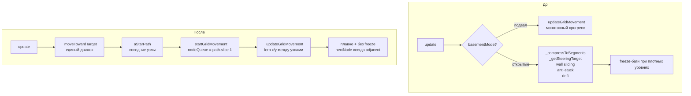

# 🎯 Open-Level Grid-Node Movement Plan (v2 — с учётом code review)

> **Цель**: убрать два движка (continuous steering + grid-node) и оставить один — tile-based с lerp-интерполяцией — для всех уровней.
> **Scope**: [`js/owner.js`](../js/owner.js), [`tests/owner-steering.test.js`](../tests/owner-steering.test.js), [`ARCHITECTURE.md`](../ARCHITECTURE.md)
> **Тесты до**: 458 passed

---

##  Почему это правильно

### Текущая ситуация

В [`js/owner.js`](../js/owner.js) два движка:

| Режим | Движок | Проблемы |
|---|---|---|
| Подвал (`basementMode !== ""`) | Grid-node: `_updateGridMovement()` | ✅ Нет freeze, монотонный прогресс |
| Открытые уровни (`basementMode === ""`) | Continuous steering: `_compressToSegments()` + `_getSteeringTarget()` + wall sliding | ⚠️ Freeze-баги при плотных уровнях (8+), сложный код |

Весь [`_moveTowardTarget()`](../js/owner.js:576) — это огромный `if (basementMode !== "")` на ~180 строк. Два движка = двойная поверхность для багов.

### Что даёт единый движок

- **Нет freeze на открытых уровнях** — монотонный `moveProgress` не осциллирует
- **Нет `basementMode !== ""` развилок** — код чище на ~150 строк
- **Нет anti-stuck** — не нужен, прогресс монотонный
- **Плавность сохраняется** — lerp между узлами идентичен текущему подвалу
- **Дрейф убирается** — без него, посмотрим на ощущение

---

## 🗑️ Что удаляется

| Компонент | Файл | Причина |
|---|---|---|
| `_compressToSegments()` | [`js/owner.js`](../js/owner.js) | Заменяется `_startGridMovement()` (уже есть) |
| `_getSteeringTarget()` | [`js/owner.js`](../js/owner.js) | Заменяется `_updateGridMovement()` (уже есть) |
| `_smoothPath()` + `_hasLineOfSight()` | [`js/owner.js`](../js/owner.js) | Нарушают инвариант "nextNode всегда adjacent": схлопывание `(5,5)→(8,5)` даёт сегмент 120px — движущееся препятствие посередине снова создаёт проблемы. A* уже возвращает оптимальный путь по соседним ячейкам. |
| `pathSegments` / `segmentIndex` | [`js/owner.js`](../js/owner.js) | Заменяется `nodeQueue` / `currentNode` / `nextNode` |
| `ALIGN_THRESHOLD` / `EPSILON` | [`js/owner.js`](../js/owner.js) | Не нужны в grid-node |
| Wall sliding в `_moveTowardTarget` | [`js/owner.js`](../js/owner.js) | Движение по свободным A* ячейкам |
| Anti-stuck (`stuckTimer`, `lastCheckTimer`, `NET_THRESHOLD2`) | [`js/owner.js`](../js/owner.js) | Не нужен — монотонный прогресс |
| `driftAngle` / `driftTimer` (навигационный) | [`js/owner.js`](../js/owner.js) | Несовместим с tile-based: вращение вектора нарушает ортогональность движения. Заменяется визуальным wobble в `draw()`. |
| `basementMode !== ""` guard в `_moveTowardTarget` | [`js/owner.js`](../js/owner.js) | Один движок — нет развилки |

## ✅ Что остаётся без изменений

| Компонент | Причина |
|---|---|
| `_updateGridMovement()` | Уже реализован, работает |
| `_advanceToNextNode()` | Уже реализован, работает |
| `_startGridMovement()` | Уже реализован, работает |
| `escapeObstacles()` call | Нужен для движущихся препятствий |
| `hesitateTimer` (микро-заморозки) | Работает так же — просто не вызываем `_updateGridMovement()` |
| `flee()` / `catnip` | Используют `_moveTowardTarget()` — адаптируем |
| `currentNode`, `nextNode`, `moveProgress`, `nodeQueue`, `segmentLength`, `lastPlayerCell` | Уже есть |
| `facingX` / `facingY` | Обновляются в `_advanceToNextNode()` |
| `shotReactTimer` | Без изменений |
| `PATH_RECALC` | Используется как fallback таймер |

---

## 📐 Детальная архитектура изменений

### 1. Поля объекта `owner` — что убрать

```javascript
// УБРАТЬ:
pathSegments: [],   // заменяется nodeQueue
segmentIndex: 0,    // заменяется currentNode/nextNode
driftAngle: 0,      // убираем
driftTimer: 0,      // убираем
stuckTimer: 0,      // убираем
lastX: 800,         // убираем
lastY: 300,         // убираем
lastCheckTimer: 0,  // убираем

// ОСТАВИТЬ (уже есть):
currentNode: null,
nextNode: null,
moveProgress: 0,
segmentLength: 40,
nodeQueue: [],
lastPlayerCell: null,
hesitateTimer: 0,
shotReactTimer: 0,
```

### 2. `activate()` — убрать сброс удалённых полей

```javascript
// УБРАТЬ из activate():
this.pathSegments = [];
this.segmentIndex = 0;
this.driftAngle = 0;
this.driftTimer = 0;
this.stuckTimer = 0;
this.lastX = this.x;
this.lastY = this.y;
this.lastCheckTimer = 0;

// ОСТАВИТЬ (уже есть):
this.currentNode = (best.col !== undefined) ? { col: best.col, row: best.row } : null;
this.nextNode = null;
this.moveProgress = 0;
this.segmentLength = GRID;
this.nodeQueue = [];
this.lastPlayerCell = null;
```

**Важно**: на открытых уровнях спавн пиксельный (углы комнаты), `best.col` не определён.
Нужно добавить инициализацию `currentNode` через `pixelToCell`:

```javascript
// В activate(), после установки this.x = best.x; this.y = best.y:
if (best.col !== undefined) {
  // Подвал: ячеечный спавн
  this.currentNode = { col: best.col, row: best.row };
} else {
  // Открытые уровни: вычисляем ячейку из пиксельной позиции
  this.currentNode = pixelToCell(this.x + this.width/2, this.y + this.height/2);
}
```

### 3. `flee()` — адаптация под grid-node

Сейчас `flee()` устанавливает `fleeTarget` (пиксельные координаты угла) и сбрасывает `pathSegments`.
В `update()` при `fleeTimer > 0` вызывается `_moveTowardTarget(fleeTarget.x, fleeTarget.y, speed * 1.4)`.

`_moveTowardTarget` теперь использует grid-node — это работает корректно: цель в пикселях конвертируется в ячейку через `pixelToCell`, A* строит путь, grid-node движется.

```javascript
// flee() — убрать сброс pathSegments/segmentIndex, оставить grid-node сброс:
flee() {
  // ... выбор fleeTarget (без изменений) ...
  this.fleeTarget = best;
  this.fleeTimer = 300;
  this.path = [];
  // Grid-node reset (уже есть):
  this.currentNode = null;
  this.nextNode = null;
  this.nodeQueue = [];
  this.moveProgress = 0;
  // УБРАТЬ:
  // this.pathSegments = [];
  // this.segmentIndex = 0;
  this.pathTimer = 0;
  this.hesitateTimer = 0;
},
```

### 4. `_moveTowardTarget()` — полная замена

Убираем весь continuous steering код. Остаётся только grid-node ветка (которая сейчас только для подвала):

```javascript
_moveTowardTarget(tx, ty, spd) {
  // ===== ЕДИНЫЙ ДВИЖОК: Grid-node movement (все уровни) =====
  // AI думает в ячейках, физика рендерит в пикселях.
  // Нет wall sliding, нет centering, нет threshold oscillation.

  const goalCell = pixelToCell(tx + this.width/2, ty + this.height/2);

  // Event-based repath triggers:
  // 1. Таймер истёк (fallback)
  // 2. Путь исчерпан (nextNode === null и очередь пуста)
  // 3. Игрок перешёл в другую ячейку
  const playerCellChanged = this.lastPlayerCell !== null &&
    (goalCell.col !== this.lastPlayerCell.col || goalCell.row !== this.lastPlayerCell.row);

  this.pathTimer--;
  const needRepath = this.pathTimer <= 0 ||
                     (!this.nextNode && this.nodeQueue.length === 0) ||
                     playerCellChanged;

  // Repath только при прибытии в узел (moveProgress < 0.1) — предотвращает телепорт.
  // Исключение: nextNode === null (путь исчерпан) — repath всегда разрешён.
  const canRepath = needRepath && (this.moveProgress < 0.1 || !this.nextNode);

  if (canRepath) {
    this.pathTimer = this.PATH_RECALC; // 30 кадров (~0.5 сек)
    this.lastPlayerCell = { col: goalCell.col, row: goalCell.row };

    // Стартовая ячейка: currentNode если есть, иначе вычисляем из пикселей
    const ownerCell = this.currentNode ||
      pixelToCell(this.x + this.width/2, this.y + this.height/2);

    if (typeof _debugSteering !== "undefined" && _debugSteering) {
      console.log(`[GRID-REPATH] from=(${ownerCell.col},${ownerCell.row}) to=(${goalCell.col},${goalCell.row}) progress=${this.moveProgress.toFixed(2)}`);
    }

    const newPath = aStarPath(
      ownerCell.col, ownerCell.row,
      goalCell.col, goalCell.row,
      this.width, this.height
    );

    if (newPath && newPath.length >= 2) {
      this.path = newPath; // для draw() sign logic
      // НЕ вызываем _smoothPath() — инвариант: nextNode всегда adjacent (1 ячейка)
      // Схлопывание узлов нарушает это и создаёт длинные сегменты с проблемами посередине
      if (!this.currentNode) {
        // Первый старт — snap к первому узлу
        this._startGridMovement(newPath, true);
      } else {
        // Mid-path repath — не сбрасываем currentNode, только обновляем очередь
        this._startGridMovement(newPath, false);
      }
    } else {
      // A* не нашёл путь — ждём следующего интервала
      this.path = [];
      this.nodeQueue = [];
      // nextNode оставляем — продолжаем текущее движение если есть
    }
  }

  this._updateGridMovement(spd);
},
```

**Ключевые отличия от basement-версии:**
- `this.PATH_RECALC` (30) вместо хардкода 30 — единый таймер
- `_smoothPath()` **не вызывается** — инвариант adjacent nodes
- Нет `basementMode !== ""` guard

### 5. `update()` — убрать anti-stuck и дрейф

```javascript
update() {
  if (!this.active) return;
  if (yarnFreezeTimer > 0) return;

  // Котовник — без изменений
  if (catnipTimer > 0) { ... }

  // escapeObstacles — без изменений (spiral search + grid reset)
  if (escapeObstacles(this)) { ... }

  // Бегство — без изменений
  if (this.fleeTimer > 0) { ... }

  // Очистка какашек — без изменений
  if (this.facePoops.length > 0 && this.poopHits >= 3) { ... }

  // Таймер реакции на выстрел — без изменений
  if (this.shotReactTimer > 0) this.shotReactTimer--;

  // Микро-заморозка — без изменений
  if (this.hesitateTimer > 0) {
    this.hesitateTimer--;
    return;
  }

  // УБРАТЬ: дрейф и микро-заморозки (basementMode === "" блок)
  // УБРАТЬ: весь anti-stuck блок (basementMode === "" блок)

  // Микро-заморозки — оставляем, но без basementMode guard:
  if (Math.random() < 0.004) {
    this.hesitateTimer = 12;
  }

  // Преследование кота через A*
  const tx = player.x + player.size/2 - this.width/2;
  const ty = player.y + player.size/2 - this.height/2;
  this._moveTowardTarget(tx, ty, this.speed);

  // Поймал кота — без изменений
  if (rectsOverlap(playerRect(), ownerRect(), -6)) { ... }
},
```

### 6. `draw()` — знак над головой + визуальный wobble

**Знак над головой** — убираем `basementMode` guard:

```javascript
// Было:
const isChasing = (basementMode !== "")
  ? (this.nodeQueue.length > 0 || this.nextNode !== null)
  : this.path.length >= 2;

// Стало:
const isChasing = this.nodeQueue.length > 0 || this.nextNode !== null;
```

**Визуальный wobble** — заменяет навигационный `driftAngle`. Чисто рендер-эффект, не влияет на `owner.x/y`, коллизии и A*:

```javascript
// В draw(), при вызове drawSprite:
// Синусоидальное смещение ±1.5px — даёт "живость" без нарушения инвариантов
const wobbleX = Math.sin(_now / 220) * 1.5;
const wobbleY = Math.cos(_now / 310) * 1.0;
drawSprite(masterImage, this.x + wobbleX, this.y + wobbleY, this.width, this.height, ...);
```

Wobble применяется только при активном преследовании (`isChasing`), не при бегстве.

---

## 🔄 Диаграмма: до и после



---

## 🧪 Тесты: что делать

### Тесты для удаления (методы удаляются)

В [`tests/owner-steering.test.js`](../tests/owner-steering.test.js):

| describe | Причина удаления |
|---|---|
| `_compressToSegments() — path compression` (строки 73–178) | Метод удаляется |
| `_getSteeringTarget() — target projection` (строки 181–267) | Метод удаляется |
| `segment completion — segmentIndex advances on progress` (строки 270–353) | `segmentIndex` удаляется |
| `_compressToSegments() called after A* repath` (строки 356–394) | Метод удаляется |
| `steering movement — facingX/Y stays unit vector` (строки 397–446) | Тест steering-специфичен |
| `steering — activate() resets pathSegments and segmentIndex` (строки 476–492) | Поля удаляются |
| `steering — flee() resets pathSegments and segmentIndex` (строки 495–507) | Поля удаляются |
| `steering — basement corridor movement` (строки 510–573) | Заменяется grid-node тестами |
| `steering — dynamic obstacle forces repath` (строки 576–608) | Адаптировать под grid-node |
| `corner-freeze regression — _getSteeringTarget with owner behind segment start` (строки 804–847) | Метод удаляется |
| `off-axis freeze regression — orthogonal centering` (строки 891–1060) — тесты `_getSteeringTarget` | Метод удаляется |
| `freeze-3: wall-corner deadlock` тесты | Не актуальны в grid-node |

### Тесты для обновления

| describe | Что изменить |
|---|---|
| `steering — no stuckNudge property` | Убрать тест `stuckTimer resets` (anti-stuck удаляется) |
| `corner-freeze regression — stuckTimer threshold` | Удалить оба теста (stuckTimer удаляется) |
| `freeze-5 regression` | Адаптировать: проверять grid-node state вместо pathSegments |
| `resetCommon()` в обоих файлах | Убрать `owner.pathSegments`, `owner.segmentIndex`, `owner.driftAngle`, `owner.driftTimer`, `owner.stuckTimer`, `owner.lastX`, `owner.lastY`, `owner.lastCheckTimer` |

### Новые тесты для добавления

```
describe('grid-node movement — open levels')
  ✅ owner makes forward progress on open level (no obstacles, straight path)
  ✅ owner makes forward progress on open level with L-shaped path
  ✅ repath triggers when player changes cell (open level)
  ✅ repath triggers when nodeQueue exhausted (open level)
  ✅ repath blocked mid-transition (moveProgress > 0.1)
  ✅ activate() sets currentNode from pixelToCell on open level (best.col undefined)
  ✅ flee() resets grid-node state (currentNode=null, nodeQueue=[])
  ✅ hesitateTimer stops movement for N frames (open level)
  ✅ nextNode always adjacent (col diff <= 1 AND row diff <= 1) — инвариант
  ✅ isChasing = nodeQueue.length > 0 || nextNode !== null (no basementMode guard)
  ✅ visual wobble: draw() does not modify owner.x/y
```

### Тесты для сохранения (без изменений)

```
describe('grid-node movement — node arrival')  ← убрать "(basement)" из названия
describe('grid-node movement — forward progress in corridor')  → оставить
describe('freeze-4 regression')  → оставить (escapeObstacles механизм не меняется)
describe('freeze-5 regression')  → адаптировать (убрать pathSegments проверки)
```

---

## 📋 Пошаговый план реализации

### Шаг 1: Удалить поля из объекта `owner`

В [`js/owner.js`](../js/owner.js) удалить из объекта `owner`:
- `pathSegments: []`
- `segmentIndex: 0`
- `driftAngle: 0`
- `driftTimer: 0`
- `stuckTimer: 0`
- `lastX: 800`
- `lastY: 300`
- `lastCheckTimer: 0`

### Шаг 2: Обновить `activate()`

- Убрать сброс удалённых полей
- Добавить `currentNode` инициализацию через `pixelToCell` для открытых уровней (когда `best.col === undefined`)

### Шаг 3: Обновить `flee()`

- Убрать `this.pathSegments = []` и `this.segmentIndex = 0`
- Оставить grid-node сброс (уже есть)

### Шаг 4: Переписать `_moveTowardTarget()`

- Удалить весь continuous steering код (open levels ветка)
- Убрать `if (basementMode !== "")` guard
- Оставить только grid-node логику с `PATH_RECALC`
- **Не вызывать `_smoothPath()`** — инвариант adjacent nodes

### Шаг 5: Обновить `update()`

- Убрать блок дрейфа (`driftTimer`, `driftAngle`)
- Убрать блок anti-stuck (`lastCheckTimer`, `stuckTimer`, `NET_THRESHOLD2`)
- Оставить микро-заморозки (`hesitateTimer`) без `basementMode` guard

### Шаг 6: Обновить `draw()`

- Заменить `isChasing` логику: убрать `basementMode` guard → `nodeQueue.length > 0 || nextNode !== null`
- Добавить визуальный wobble при рендеринге спрайта (±1.5px синусоида по `_now`)
- Знак `!` над головой — **без изменений**, это чисто визуальная фишка

### Шаг 7: Удалить методы

- `_compressToSegments()` — удалить полностью
- `_getSteeringTarget()` — удалить полностью
- `_smoothPath()` — удалить полностью
- `_hasLineOfSight()` — удалить полностью (использовался только в `_smoothPath`)

### Шаг 8: Обновить тесты

- Удалить тесты удалённых методов (см. таблицу выше)
- Обновить `resetCommon()` в обоих файлах — убрать удалённые поля
- Добавить новые тесты для open-level grid-node (см. список выше)

### Шаг 9: Обновить `ARCHITECTURE.md`

- Уже обновлён (единый движок, убран раздел Continuous Steering)

---

## ⚠️ Риски и митигации

| Риск | Вероятность | Митигация |
|---|---|---|
| Хозяин выглядит "роботизированно" без дрейфа | Средняя | Визуальный wobble в `draw()` + микро-заморозки сохраняются |
| `flee()` и `catnip` работают некорректно | Низкая | `_moveTowardTarget` принимает пиксельные координаты → `pixelToCell` → A* → grid-node |
| Движущиеся препятствия (уровень 5+) толкают хозяина | Низкая | `escapeObstacles()` → hard snap + repath (механизм уже есть) |
| Спавн хозяина на открытых уровнях попадает в занятую ячейку | Низкая | `pixelToCell` от центра спавна; `escapeObstacles` исправит на первом кадре |
| Тесты `pathSegments`/`segmentIndex`/`stuckTimer` сломаются | Высокая | Удалить/адаптировать согласно плану выше |
| Длинный сегмент после smoothing нарушает adjacent-инвариант | Устранено | `_smoothPath()` удалён — A* всегда возвращает соседние узлы |

---

## 📊 Ожидаемый результат

| Метрика | До | После |
|---|---|---|
| Строк в `owner.js` | ~940 | ~700 (-240) |
| Методов | 12 | 8 (-4: `_compressToSegments`, `_getSteeringTarget`, `_smoothPath`, `_hasLineOfSight`) |
| `basementMode` guards в `owner.js` | 8+ | 0 |
| Freeze-баги на открытых уровнях | Редко | Устранены архитектурно |
| Anti-stuck код | ~30 строк | 0 |
| Навигационный дрейф | Есть | Убран; визуальный wobble в `draw()` |

---

## 🔑 Ключевые инварианты после реализации

1. **Adjacent nodes**: `nextNode` всегда отличается от `currentNode` ровно на 1 по col ИЛИ row — никаких длинных сегментов
2. **Монотонный прогресс**: `moveProgress` только возрастает — осцилляция невозможна
3. **Чистый lerp**: `owner.x/y` — всегда точный `cellToPixel(currentNode)` или lerp между двумя соседними ячейками
4. **Нет навигационной физики**: нет `ALIGN_THRESHOLD`, нет `EPSILON`, нет `perpDist`, нет wall sliding
5. **Нет anti-stuck**: монотонный прогресс делает его ненужным
6. **Escape = hard snap**: `escapeObstacles` → snap к ближайшей свободной ячейке + repath
7. **Repath только у узла**: `moveProgress < 0.1` или `nextNode === null` — предотвращает телепорт
8. **Визуальный wobble ≠ навигация**: `draw()` смещает спрайт, `owner.x/y` не меняется
