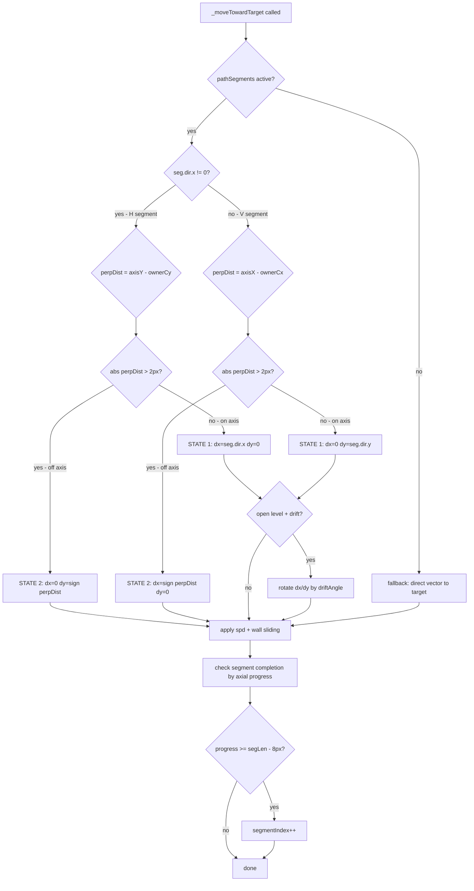

# 🏗️ Orthogonal Steering Plan — Architectural Assessment & Implementation

> **Status:** Planning
> **Scope:** `js/owner.js` (primary), `tests/owner-steering.test.js` (new tests), `ARCHITECTURE.md`
> **Tests before:** 458 passed
> **Goal:** Eliminate infinite freeze loops by making owner movement strictly orthogonal (H or V, never diagonal)

---

## 1. Architectural Assessment of the Proposal

### The Core Hypothesis

> "Diagonal movement (simultaneous X+Y) is the root cause of all freezes."

**Verdict: CORRECT — and provable from the existing code.**

### Why Diagonal Movement Causes Freezes

The current steering system in [`js/owner.js`](../js/owner.js) computes a normalized `(dx, dy)` vector toward the steering target, then applies it with wall-sliding:

```js
// Lines 700–707 in owner.js
const nx = this.x + dx * spd;
const ny = this.y + dy * spd;
const xOk = !hitsObstacles(nrX) && nx >= b.left && nx <= b.right - this.width;
const yOk = !hitsObstacles(nrY) && ny >= b.top  && ny <= b.bottom - this.height;
if (xOk) this.x = nx;
if (yOk) this.y = ny;
```

When the steering target is `(axisX, perpY)` — a mix of the axis position and the corridor center — the resulting `(dx, dy)` is **almost never purely horizontal or vertical**. It's always slightly diagonal.

**The freeze chain:**

```
seg=H, ownerY=92, axisY0=110 (corridor center)
→ perpY = 110 (escape-down triggered)
→ steerTarget = (axisX=640, perpY=110)
→ ownerCy = 110 (center), ownerY = 92 → dy = 110 - 92 = 18 (center to top)
→ dx = 640 - ownerCx (large), dy = 18 (small)
→ normalized: dx≈0.998, dy≈0.063
→ ny = 92 + 0.063 * spd = 92.25 (moves 0.25px/frame toward axis)
→ net displacement over 10 frames = 2.5px → barely above NET_THRESHOLD2=2
→ escape-down fires again → perpY=110 → same vector → oscillation
→ escapeObstacles() pushes owner to y=217 → pathTimer=0 → repath
→ new path: same first=(29,5) last=(1,7) → same segments → same freeze
```

**The diagonal is the problem.** The tiny `dy` component (0.063 * spd) is insufficient to move the owner out of the boundary zone before the next escape fires. The owner oscillates between "escape pushes up" and "steering pulls down" with sub-pixel net displacement.

### Why Orthogonal Movement Eliminates This

If movement is **strictly H or V** at any given moment:
- On a horizontal segment: `dx = ±spd, dy = 0` — owner moves purely sideways
- On a vertical segment: `dx = 0, dy = ±spd` — owner moves purely up/down
- Perpendicular correction (centering on corridor axis) happens as a **separate phase** with full speed

There is no "tiny dy" problem. Either the owner is moving horizontally (and not moving vertically at all), or it's moving vertically (and not moving horizontally at all). The escape/centering oscillation cannot occur because the two axes are never mixed.

---

## 2. Scope: All Levels vs Basement Only

### Option A: Basement Only

**Pros:**
- Minimal risk — open levels are already working
- Smaller diff

**Cons:**
- Open levels also have the freeze bug (just less visible because obstacles are sparse)
- Two different movement models to maintain
- The `basementMode !== ""` guard pattern already causes complexity in the code

### Option B: All Levels (Recommended ✅)

**Pros:**
- Single movement model — simpler code
- Eliminates the freeze on open levels too
- The segment model (`pathSegments`) already exists and works for both
- On open levels, segments are mostly long straight runs — orthogonal movement is natural
- Drift (`driftAngle`) can still be applied as a **post-normalization rotation** on open levels without breaking orthogonality (see Section 4)

**Cons:**
- Slightly more testing needed
- Movement on open levels will look slightly more "robotic" (but drift compensates)

**Decision: Apply orthogonal steering to all levels.** The segment model already classifies every segment as H or V. We just need to enforce that the movement vector matches the segment direction.

---

## 3. Root Cause Summary (from log analysis)

The log shows three distinct freeze patterns, all caused by diagonal movement:

| Pattern | Trigger | Diagonal component | Result |
|---|---|---|---|
| **Freeze-A** | `escape-down` + H segment | `dy ≈ 0.06` (tiny) | Net displacement < threshold → STUCK |
| **Freeze-B** | `1px-free` + H segment | `dy ≈ 0.1` (small) | Oscillation between escape and centering |
| **Freeze-C** | `escape` → repath → same path | Both axes blocked | Owner re-enters same obstacle |

All three are eliminated by orthogonal movement because:
- Freeze-A/B: no tiny `dy` — centering is a separate full-speed phase
- Freeze-C: after escape, centering phase moves owner fully onto corridor axis before horizontal movement resumes

---

## 4. Architecture: Orthogonal Steering Model

### Core Principle

At any frame, the owner is in exactly one of two states:

```
STATE 1: AXIS MOVEMENT
  - Owner is sufficiently centered on corridor axis (|perp| ≤ ALIGN_THRESHOLD)
  - Move along segment direction at full speed: dx = dir.x * spd, dy = dir.y * spd
  - No perpendicular component

STATE 2: CENTERING
  - Owner is off-axis (|perp| > ALIGN_THRESHOLD)
  - Move perpendicular to segment direction at full speed toward axis
  - No axial component
```

This is a **state machine**, not a blended vector. The two states never mix.

### ALIGN_THRESHOLD

```js
const ALIGN_THRESHOLD = 2; // px — owner center must be within 2px of corridor axis
```

- Owner is 36px wide, corridor is 40px wide → 4px of slack
- 2px threshold means owner is within 1px of center on each side
- At `spd = 4.5` (normal max), centering takes at most `ceil(4/4.5) = 1` frame

### Movement Vector Construction

```js
// In _moveTowardTarget(), replace the steerTarget blending with:

const seg = this.pathSegments[this.segmentIndex];
let dx = 0, dy = 0;

if (seg.dir.x !== 0) {
  // HORIZONTAL segment
  const ownerCy = this.y + this.height / 2;
  const axisY = seg.startPx.y; // corridor center Y
  const perpDist = axisY - ownerCy;

  if (Math.abs(perpDist) > ALIGN_THRESHOLD) {
    // STATE 2: center on axis first (pure vertical movement)
    dy = perpDist > 0 ? 1 : -1;
    dx = 0;
  } else {
    // STATE 1: move along segment (pure horizontal movement)
    dx = seg.dir.x; // already normalized (±1)
    dy = 0;
  }
} else {
  // VERTICAL segment
  const ownerCx = this.x + this.width / 2;
  const axisX = seg.startPx.x; // corridor center X
  const perpDist = axisX - ownerCx;

  if (Math.abs(perpDist) > ALIGN_THRESHOLD) {
    // STATE 2: center on axis first (pure horizontal movement)
    dx = perpDist > 0 ? 1 : -1;
    dy = 0;
  } else {
    // STATE 1: move along segment (pure vertical movement)
    dy = seg.dir.y; // already normalized (±1)
    dx = 0;
  }
}
```

### Drift on Open Levels

The `driftAngle` (±10°) is currently applied as a rotation to `(dx, dy)`. With orthogonal movement, we **keep drift** but apply it only during STATE 1 (axis movement), and only on open levels:

```js
// After computing dx/dy in STATE 1, on open levels:
if (basementMode === "" && this.driftAngle !== 0) {
  const cos = Math.cos(this.driftAngle);
  const sin = Math.sin(this.driftAngle);
  const ndx = dx * cos - dy * sin;
  const ndy = dx * sin + dy * cos;
  dx = ndx; dy = ndy;
  // Note: drift re-introduces slight diagonal, but only on open levels
  // where there are no tight corridors to cause freeze
}
```

This preserves the "human" feel on open levels while keeping basement movement strictly orthogonal.

---

## 5. Segment Completion — No Change Needed

The existing segment completion logic in [`js/owner.js`](../js/owner.js) (lines 622–644) uses **axial progress** (dot product along segment direction), not distance. This is already orthogonal-aware and works correctly:

```js
const progress = toOwnerX * seg.dir.x + toOwnerY * seg.dir.y;
const EPSILON = 8;
if (progress >= segLen - EPSILON) {
  this.segmentIndex++;
  ...
}
```

No change needed here.

---

## 6. Escape Mechanism — Simplified

The current `_getSteeringTarget()` has complex `escape-down`/`escape-up`/`escape-left`/`escape-right` logic (lines 503–513) that tries to force perpendicular movement when the owner is near a wall. This is **entirely replaced** by the orthogonal state machine:

- STATE 2 (centering) already moves the owner toward the axis at full speed
- No need for boundary-escape heuristics
- No need for `1px-free` wall checks in the steering target

The `escapeObstacles()` call in `update()` (line 801) is kept — it handles the case where a moving obstacle pushes the owner into a wall. After escape, `pathTimer=0` forces repath (existing freeze-4 fix, kept).

---

## 7. What Changes vs What Stays

### Changes

| Component | Before | After |
|---|---|---|
| `_getSteeringTarget()` | Returns blended `(axisX, perpY)` point | **Deleted** — replaced by inline orthogonal logic |
| Movement vector in `_moveTowardTarget()` | `normalize(steerTarget - ownerCenter)` | `(±1, 0)` or `(0, ±1)` — pure orthogonal |
| Perpendicular correction | Wall-aware centering with escape heuristics | Simple: if `|perp| > ALIGN_THRESHOLD` → center, else → advance |
| `escape-down/up/left/right` logic | Lines 503–513 in `_getSteeringTarget()` | **Deleted** |
| `1px-free` wall check | Lines 490–498 | **Deleted** |
| `WALL-CORNER ESCAPE` block | Lines 718–751 | **Deleted** — orthogonal movement never needs this |

### Stays Unchanged

| Component | Reason |
|---|---|
| `_compressToSegments()` | Already correct — produces H/V segments |
| `aStarPath()` in `pathfinding.js` | Untouched |
| `escapeObstacles()` call | Needed for moving obstacles |
| `pathTimer`, `PATH_RECALC` | Unchanged |
| Net-displacement anti-stuck | Kept — still useful as safety net |
| `_smoothPath()` | Kept for basement |
| `flee()`, `catnip`, `hesitateTimer` | Untouched |
| `driftAngle` on open levels | Kept (applied after orthogonal vector) |
| All existing tests | Must pass without modification |

---

## 8. Implementation Steps

### Step 1 — Delete `_getSteeringTarget()`

Remove the entire method (lines 441–560 in current `owner.js`). It is replaced by inline logic in `_moveTowardTarget()`.

### Step 2 — Rewrite movement vector in `_moveTowardTarget()`

Replace the block starting at line 648 (`const steerTarget = this._getSteeringTarget()`) with the orthogonal state machine described in Section 4.

The new block:

```js
// ===== ORTHOGONAL STEERING =====
// Owner moves strictly H or V — never diagonal.
// STATE 1: centered on axis → advance along segment
// STATE 2: off-axis → center first (full speed, perpendicular)
const ALIGN_THRESHOLD = 2; // px

if (this.segmentIndex < this.pathSegments.length) {
  const seg = this.pathSegments[this.segmentIndex];

  if (seg.dir.x !== 0) {
    // Horizontal segment
    const ownerCy = this.y + this.height / 2;
    const axisY = seg.startPx.y;
    const perpDist = axisY - ownerCy;
    if (Math.abs(perpDist) > ALIGN_THRESHOLD) {
      dx = 0;
      dy = perpDist > 0 ? 1 : -1;
    } else {
      dx = seg.dir.x;
      dy = 0;
    }
  } else {
    // Vertical segment
    const ownerCx = this.x + this.width / 2;
    const axisX = seg.startPx.x;
    const perpDist = axisX - ownerCx;
    if (Math.abs(perpDist) > ALIGN_THRESHOLD) {
      dx = perpDist > 0 ? 1 : -1;
      dy = 0;
    } else {
      dx = 0;
      dy = seg.dir.y;
    }
  }

  // Update facing direction
  if (dx !== 0 || dy !== 0) {
    this.facingX = dx;
    this.facingY = dy;
  }

  // Apply drift on open levels (STATE 1 only — when moving along axis)
  if (basementMode === "" && this.driftAngle !== 0 && (
    (seg.dir.x !== 0 && dy === 0) || (seg.dir.y !== 0 && dx === 0)
  )) {
    const cos = Math.cos(this.driftAngle);
    const sin = Math.sin(this.driftAngle);
    const ndx = dx * cos - dy * sin;
    const ndy = dx * sin + dy * cos;
    dx = ndx; dy = ndy;
  }

} else {
  // No active segment — direct movement toward target (fallback)
  dx = tx - this.x;
  dy = ty - this.y;
  const dist2 = dx * dx + dy * dy;
  if (dist2 > 0.01) {
    const dist = Math.sqrt(dist2);
    dx /= dist; dy /= dist;
    this.facingX = dx;
    this.facingY = dy;
  }
}
```

### Step 3 — Delete WALL-CORNER ESCAPE block

Remove lines 709–751 (the `if (!xOk && ...)` and `if (!yOk && ...)` blocks). These were compensating for diagonal movement getting stuck at corners. With orthogonal movement, they are never needed.

### Step 4 — Update debug logging

The `[STEER-DETAIL]` log in the deleted `_getSteeringTarget()` is gone. Add a simpler log in the new orthogonal block:

```js
if (typeof _debugSteering !== "undefined" && _debugSteering) {
  const state = (Math.abs(perpDist) > ALIGN_THRESHOLD) ? "CENTERING" : "ADVANCING";
  console.log(`[STEER] seg=${seg.dir.x !== 0 ? 'H' : 'V'} state=${state} perpDist=${perpDist.toFixed(2)} dx=${dx.toFixed(2)} dy=${dy.toFixed(2)} ownerX=${Math.round(this.x)} ownerY=${Math.round(this.y)}`);
}
```

### Step 5 — Add new tests to `tests/owner-steering.test.js`

Add tests that verify orthogonal behavior:

1. **"orthogonal H segment: dy=0 when centered"** — owner on axis → `dy === 0`
2. **"orthogonal H segment: dx=0 when off-axis"** — owner off-axis → `dx === 0`
3. **"orthogonal V segment: dx=0 when centered"** — owner on axis → `dx === 0`
4. **"orthogonal V segment: dy=0 when off-axis"** — owner off-axis → `dy === 0`
5. **"centering completes in 1 frame at max speed"** — owner 4px off-axis, spd=4.5 → centered after 1 frame
6. **"no freeze: H segment with owner near bottom wall"** — simulate the exact freeze scenario from the log → owner makes progress every 10 frames

### Step 6 — Update `ARCHITECTURE.md`

Update the "Steering corridor model" section to describe the orthogonal state machine.

---

## 9. Risk Analysis

| Risk | Likelihood | Mitigation |
|---|---|---|
| Owner gets stuck in centering loop (wall blocks centering) | Low | `escapeObstacles()` handles this; centering direction is toward axis, not into wall |
| Owner overshoots segment end during centering | Low | Segment completion check uses axial progress — centering doesn't advance axial progress |
| Open level movement looks too robotic | Medium | Drift is preserved; open levels have long segments so centering is rare |
| Existing tests break | Low | Only `_moveTowardTarget()` internals change; public API unchanged |
| Centering blocks progress at turns | Low | At a turn, the new segment's axis is perpendicular to the old one — centering on new axis is the correct behavior |

---

## 10. Code Size Impact

| Section | Lines Before | Lines After | Delta |
|---|---|---|---|
| `_getSteeringTarget()` | ~120 lines | 0 (deleted) | -120 |
| Movement vector block | ~30 lines | ~35 lines | +5 |
| WALL-CORNER ESCAPE block | ~35 lines | 0 (deleted) | -35 |
| Debug logging | ~10 lines | ~5 lines | -5 |
| **Total** | **~195 lines** | **~40 lines** | **-155 lines** |

This is a **significant simplification** — the most complex parts of `owner.js` are deleted.

---

## 11. Mermaid: Orthogonal State Machine



---

## 12. Files to Change

| File | Change |
|---|---|
| [`js/owner.js`](../js/owner.js) | Delete `_getSteeringTarget()`; rewrite movement vector block; delete WALL-CORNER ESCAPE block; update debug log |
| [`tests/owner-steering.test.js`](../tests/owner-steering.test.js) | Add 6 orthogonal-specific tests |
| [`ARCHITECTURE.md`](../ARCHITECTURE.md) | Update steering model description |

---

## 13. Success Criteria

- [ ] All 458 existing tests pass (zero regressions)
- [ ] New orthogonal tests pass
- [ ] `_getSteeringTarget()` is deleted
- [ ] WALL-CORNER ESCAPE block is deleted
- [ ] `owner.js` is shorter by ~150 lines
- [ ] Basement AI moves through corridors without any freeze
- [ ] Open level AI still has drift behavior
- [ ] No `[STUCK] force repath` in console during normal play
- [ ] No `[ESCAPE] owner inside obstacle` oscillation loop

---

## 14. What This Does NOT Fix

- If A* returns a path that goes through a 1-cell-wide gap that the owner physically cannot enter (36px owner, 40px cell — 4px slack), the owner will center on the axis and then be blocked by the wall. This is an A* path quality issue, not a steering issue. The existing `escapeObstacles()` + repath handles this.
- Moving obstacles that push the owner off-axis mid-segment. The centering phase handles this automatically — owner will center before advancing.
