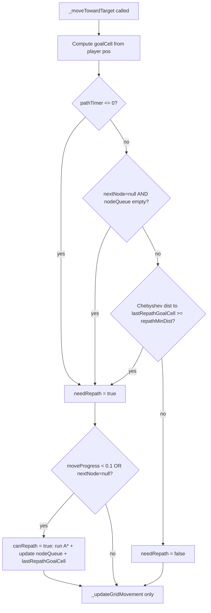

# 🔧 Plan: Owner Oscillation Fix on Open Levels

## Problem Statement

On open levels (no obstacles), the owner oscillates visually — changing direction every ~40px (every grid cell). The debug log confirms this:

```
[GRID-REPATH] from=(0,14) to=(29,0)  progress=0.00
[GRID-REPATH] from=(2,14) to=(28,0)  progress=0.04  ← 2 cells later
[GRID-REPATH] from=(3,14) to=(26,0)  progress=0.01  ← 1 cell later
[GRID-REPATH] from=(3,14) to=(26,2)  progress=0.02  ← same cell!
[GRID-REPATH] from=(4,14) to=(26,4)  progress=0.04
[GRID-REPATH] from=(5,14) to=(26,6)  progress=0.03
[GRID-REPATH] from=(6,14) to=(24,6)  progress=0.00
```

## Root Cause

In [`js/owner.js`](js/owner.js:436), the `playerCellChanged` trigger fires every time the player enters a new cell:

```js
const playerCellChanged = this.lastPlayerCell !== null &&
  (goalCell.col !== this.lastPlayerCell.col || goalCell.row !== this.lastPlayerCell.row);
```

On open levels, the player moves freely and changes cells constantly (~every 40px / player.speed frames). Combined with the `canRepath` guard (`moveProgress < 0.1`), this means the owner re-paths at the very start of each new cell segment — **every ~40px of travel**. This is:

1. **Visually jittery** — the owner's direction changes every cell because A* recalculates to a slightly different target
2. **Wasteful** — A* runs every ~40px on open levels where the path is trivially straight
3. **Gets worse at higher levels** — faster owner speed means `moveProgress < 0.1` window is hit more often per cell

**Why it's worse on open levels specifically:** In a maze/corridor, the path is constrained and doesn't change much even if the player moves. On open levels, A* always finds a slightly different diagonal staircase path to the new target cell, causing constant re-routing. Each new A* produces a slightly different first-turn direction, so visually the owner looks like:

```
↗ ↗ ↗ ↑ ↗ ↑ ↗ ↑   ← oscillation (current)
↗ ↗ ↗ ↗ ↗ ↗ ↗ ↗   ← desired (stable)
```

**Why it worsens at higher levels / Chaos:**
- Higher owner speed → `moveProgress < 0.1` window is hit more often per cell
- Higher player speed → player changes cells faster → `playerCellChanged` fires more often
- Chaos mode: owner speed 2.3→6.5, player moves fast → worst oscillation

**Key insight:** The oscillation is **not** in the movement engine (which is already stable: adjacent nodes, monotonic progress, no steering). It is **behavioral** — the AI replanning policy is too reactive. The fix must be at the **replanning policy level**, not the movement engine.

---

## Fix Design

### Fix 1: Replanning Hysteresis via Chebyshev Distance Guard (primary fix)

This is a **low-pass filter for AI replanning** — the owner stops reacting to micro-shifts in the player's position.

Add a **Chebyshev distance threshold** to `playerCellChanged`: only trigger repath if the player has moved at least `repathMinDist` cells (Chebyshev = `max(|Δcol|, |Δrow|)`) from the **last repath goal cell**.

**Why Chebyshev?** It's O(1), no sqrt, grid-native, and diagonal-aware. A threshold of 2 means the player must move at least 2 cells (80px) in any direction before a repath is triggered.

**Semantic rename:** `lastPlayerCell` → `lastRepathGoalCell` — because what we actually store is the **last repath target**, not the current player cell. This avoids future confusion.

**New logic in [`_moveTowardTarget()`](js/owner.js:429):**

```js
const repathMinDist = DIFF[difficulty].repathMinDist;
const playerCellChanged = this.lastRepathGoalCell !== null &&
  Math.max(
    Math.abs(goalCell.col - this.lastRepathGoalCell.col),
    Math.abs(goalCell.row - this.lastRepathGoalCell.row)
  ) >= repathMinDist;
```

And on repath:
```js
this.lastRepathGoalCell = { col: goalCell.col, row: goalCell.row };
```

**Effect:** The owner still re-paths when the player moves significantly (≥ `repathMinDist` cells), but ignores micro-movements within the deadzone. The fallback timer (30 frames = 0.5s) still handles the case where the player stops or moves slowly.

**Per-difficulty tuning of `repathMinDist`:**

| Mode | `repathMinDist` | Rationale |
|---|---|---|
| 😸 Лёгкий | 3 | Owner is slow, player has more breathing room; 120px deadzone |
| 😼 Нормал | 2 | Balanced — owner reacts to 80px player movement |
| 😈 Хаос | 2 | **Same as Normal** — aggressiveness comes from speed/hesitation, not repath churn |

> **Why Chaos = 2, not 1?**
> `repathMinDist = 1` is essentially the old behavior — it still allows repath every cell boundary, which is the root cause of oscillation. Chaos aggressiveness is expressed through higher speed, lower hesitation, and shorter `PATH_RECALC` — not through repath frequency. Visual stability and responsiveness are opposing forces; `repathMinDist` is the filter cutoff, and setting it to 1 defeats the filter.

**Where to store:** Add `repathMinDist` to `DIFF` in [`js/config.js`](js/config.js:29):

```js
easy:   { ..., repathMinDist: 3 },
normal: { ..., repathMinDist: 2 },
chaos:  { ..., repathMinDist: 2 },
```

---

### Fix 2: Scale `hesitateTimer` Probability by Level (secondary fix)

Currently in [`js/owner.js`](js/owner.js:601):
```js
if (Math.random() < 0.004) {
  this.hesitateTimer = 12;
}
```

This is a flat `0.004` probability (~once per 4 sec at 60fps) and `12` frames (~0.2s) on all levels and difficulties. The owner should become more "focused" (less hesitation) as levels increase, making it harder. This transforms hesitation from **noise** into a **difficulty scaling parameter**.

**New logic — hyperbolic decay (smoother feel curve than linear):**

```js
// Hesitation decreases with level — owner becomes more focused
// Hyperbolic decay: base / (1 + level * k) — smoother than linear
const hesitateProb = Math.max(
  DIFF[difficulty].hesitateMinProb,
  DIFF[difficulty].hesitateBaseProb / (1 + (level - 1) * DIFF[difficulty].hesitateProbDecay)
);
if (Math.random() < hesitateProb) {
  this.hesitateTimer = DIFF[difficulty].hesitateDur;
}
```

> **Why hyperbolic over linear?** Linear decay (`base - level * k`) gives a long plateau then a hard floor. Hyperbolic (`base / (1 + level * k)`) gives a smooth, natural feel curve — fast initial drop, then gradual approach to the floor. This matches how difficulty should feel to the player.

**Per-difficulty constants in `DIFF`:**

| Mode | `hesitateBaseProb` | `hesitateProbDecay` | `hesitateMinProb` | `hesitateDur` |
|---|---|---|---|---|
| 😸 Лёгкий | 0.008 | 0.08 | 0.003 | 18 |
| 😼 Нормал | 0.004 | 0.10 | 0.001 | 12 |
| 😈 Хаос | 0.002 | 0.20 | 0.0 | 8 |

**Effect by level (hyperbolic):**

| Level | Easy prob | Normal prob | Chaos prob |
|---|---|---|---|
| 1 | 0.0080 | 0.0040 | 0.0020 |
| 5 | 0.0061 | 0.0029 | 0.0011 |
| 10 | 0.0044 | 0.0020 | 0.0005 |
| 15 | 0.0034 | 0.0015 | 0.0002 |
| 20+ | 0.0027→min | 0.0011→min | ~0.000 |

On Chaos at level 10+, the owner barely hesitates — near-relentless pursuit. On Easy, the owner always has meaningful hesitation even at high levels.

---

## Semantic Rename: `lastPlayerCell` → `lastRepathGoalCell`

The field `owner.lastPlayerCell` currently stores the **last repath target cell**, not the current player cell. Renaming it to `lastRepathGoalCell` makes the intent clear and prevents future confusion.

**Files affected:**
- [`js/owner.js`](js/owner.js) — rename all references (object literal, `activate()`, `_moveTowardTarget()`)
- [`tests/owner-grid.test.js`](tests/owner-grid.test.js) — update `resetCommon()` and test assertions
- [`tests/owner.test.js`](tests/owner.test.js) — update `resetCommon()`

---

## Files to Change

### [`js/config.js`](js/config.js)

Add to each `DIFF` entry:
- `repathMinDist` — minimum Chebyshev cell distance for `playerCellChanged` repath
- `hesitateBaseProb` — base probability of micro-freeze per frame
- `hesitateProbDecay` — hyperbolic decay coefficient per level
- `hesitateMinProb` — floor probability (never goes below this)
- `hesitateDur` — duration of micro-freeze in frames

### [`js/owner.js`](js/owner.js)

1. **Object literal** — rename field `lastPlayerCell: null` → `lastRepathGoalCell: null`
2. **`activate()`** — rename `this.lastPlayerCell = null` → `this.lastRepathGoalCell = null`
3. **`_moveTowardTarget()`** — rename `lastPlayerCell` → `lastRepathGoalCell`; replace `playerCellChanged` with Chebyshev distance-gated version using `DIFF[difficulty].repathMinDist`
4. **`update()`** — replace flat `Math.random() < 0.004` with hyperbolic level-scaled formula using `DIFF[difficulty]` constants

### [`tests/owner-grid.test.js`](tests/owner-grid.test.js) and [`tests/owner.test.js`](tests/owner.test.js)

- Rename `owner.lastPlayerCell` → `owner.lastRepathGoalCell` in `resetCommon()` and all test assertions

---

## Tests to Add

In [`tests/owner-grid.test.js`](tests/owner-grid.test.js):

1. **Distance guard — normal (minDist=2):** moving player 1 cell does NOT trigger repath; moving 2 cells DOES
2. **Distance guard — easy (minDist=3):** moving player 2 cells does NOT trigger repath; 3 cells DOES
3. **Distance guard — chaos (minDist=2):** same as normal — moving 1 cell does NOT trigger repath
4. **Fallback timer still works:** even with minDist=3, `pathTimer=0` still triggers repath regardless of distance
5. **Path exhausted still triggers repath:** `nextNode===null && nodeQueue===[]` triggers regardless of distance
6. **Stable facing on long open chase:** player moves diagonally for 300 frames, count facing direction changes, assert changes < threshold (e.g. < 20 for normal)
7. **hesitateProb decreases with level (hyperbolic):** at level 10 chaos, computed prob < 0.001
8. **hesitateProb has floor:** at level 50 easy, computed prob >= `hesitateMinProb`
9. **`lastRepathGoalCell` updated on repath:** after repath, `lastRepathGoalCell` equals the goal cell used

---

## Architecture Invariants Preserved

- `moveProgress` still monotonically increases — no oscillation possible from the movement engine itself
- `canRepath` guard (`moveProgress < 0.1`) still prevents mid-segment teleport
- Fallback timer (30 frames) still fires regardless of `repathMinDist`
- Path exhausted (`nextNode===null`) still triggers immediate repath
- No new mutable state fields on `owner` object — all config in `DIFF`; only rename of existing field
- Event-driven replanning + periodic fallback replanning — both preserved

---

## Mermaid: Repath Decision Flow (after fix)



---

## Summary of Changes

| What | Where | Effect |
|---|---|---|
| `repathMinDist` per difficulty | `DIFF` in `config.js` | Controls replanning hysteresis deadzone |
| Chebyshev distance-gated `playerCellChanged` | `_moveTowardTarget()` in `owner.js` | Eliminates per-cell oscillation on open levels |
| `lastPlayerCell` → `lastRepathGoalCell` | `owner.js`, test files | Semantic clarity — stores last repath target, not current player cell |
| Hyperbolic level-scaled `hesitateProb` | `update()` in `owner.js` | Owner becomes more focused at higher levels with smooth feel curve |
| Hesitate constants per difficulty | `DIFF` in `config.js` | Easy stays hesitant, Chaos becomes relentless |
| New tests | `tests/owner-grid.test.js` | Verify distance guard, stable facing, hesitate scaling |
