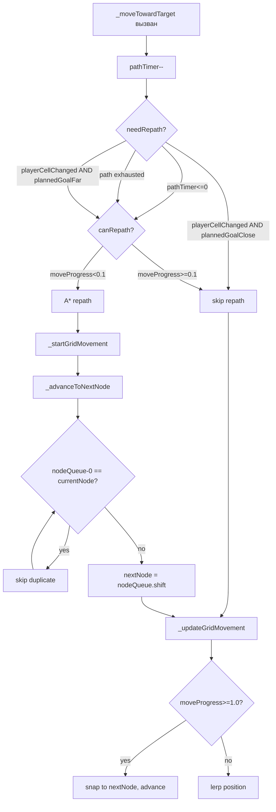

# 🐾 Plan: Owner Movement Smoothness Fix

## Problem Statement

На нормале уровень 3 хозяин движется рывками: дошёл до узла сетки → чуть стоит → следующий узел → стоит → и т.д. На поздних уровнях (высокая скорость) это менее заметно.

## Root Cause Analysis

### Причина 1: Self-loop nodes — `(23,8)->(23,8)`

Из debug-лога видно паттерн:
```
(23,8)->(23,8) progress=0.03 x=920.0 y=330.0
(23,8)->(23,8) progress=0.07 x=920.0 y=330.0
...
(23,8)->(23,8) progress=1.00 x=920.0 y=330.0
```

Хозяин "движется" из узла в **тот же самый узел** — `currentNode == nextNode`. Это происходит потому что:

1. Repath срабатывает при `moveProgress ≈ 0.01` (сразу после прибытия в узел)
2. `_startGridMovement(path, false)` ставит `nodeQueue = path.slice(1)`
3. Если `path[1] == currentNode` (A* вернул дублирующий узел) → `nextNode = currentNode`
4. `segmentLength = sqrt(0) || GRID = 40` — сегмент нулевой длины, traversal занимает `40/speed ≈ 19–25 кадров`
5. Хозяин **стоит на месте** всё это время → визуальный "тупняк"

**Почему A* может вернуть `path[1] == currentNode`?**

При `_startGridMovement(path, false)` (mid-path repath), `currentNode` не обновляется. Если `path[0] == currentNode` (нормально — это стартовая ячейка) и `path[1] == currentNode` (A* вернул дублирующий узел из-за особенностей реконструкции пути при repath в момент carry-over), то `nodeQueue[0] == currentNode` → self-loop.

Это **defensive programming** проблема: A* теоретически не должен возвращать дубликаты, но при repath в момент `moveProgress ≈ 0.01` граничные условия могут дать такой результат.

### Причина 2: Слишком частый repath по `playerCellChanged`

На нормале уровень 3:
- Скорость хозяина: `1.6 + 2*0.25 = 2.1 px/frame`
- Время пересечения одной ячейки (40px): `40/2.1 ≈ 19 кадров`
- `PATH_RECALC = 30` кадров — fallback таймер
- `repathMinDist = 2` ячейки — Chebyshev deadzone

Каждые ~19 кадров хозяин прибывает в узел (`moveProgress` сбрасывается до carry-over ≈ 0.01–0.05). В этот момент `canRepath = moveProgress < 0.1` = **true**. Игрок за 19 кадров при скорости ~3.9 px/frame проходит `19*3.9 ≈ 74px ≈ 1.85 ячейки` — почти всегда ≥ 2 ячейки → `playerCellChanged = true`.

Результат: repath почти на каждом узле → A* пересчитывается каждые 19 кадров → при каждом пересчёте возможен self-loop или смена направления → рывки.

На поздних уровнях (скорость 4.5): время пересечения ячейки = `40/4.5 ≈ 9 кадров`. Хозяин быстрее, repath реже относительно движения → плавнее.

**Ключевое наблюдение**: проблема — это **AI policy**, а не **movement engine**. Lerp и grid-node traversal работают корректно. Дёрганье — от слишком частого replanning.

---

## Solution Design

### Fix 1 (обязательный): Защита инварианта `nextNode ≠ currentNode` в `_advanceToNextNode()`

**Файл**: [`js/owner.js`](js/owner.js)
**Метод**: [`_advanceToNextNode()`](js/owner.js:333)

Добавить пропуск узлов, совпадающих с `currentNode`:

```js
_advanceToNextNode() {
  // Инвариант: nextNode никогда не должен совпадать с currentNode.
  // Пропускаем дублирующие узлы — defensive programming против edge cases repath.
  while (this.nodeQueue.length > 0) {
    const candidate = this.nodeQueue[0];
    if (candidate.col !== this.currentNode.col || candidate.row !== this.currentNode.row) break;
    this.nodeQueue.shift();
  }
  if (this.nodeQueue.length === 0) {
    this.nextNode = null;
    this.segmentLength = GRID;
    return;
  }
  this.nextNode = this.nodeQueue.shift();
  // ... остальной код без изменений
}
```

**Почему это правильно**: это защита инварианта, а не фикс симптома. `nextNode` никогда не должен совпадать с `currentNode` — это архитектурное требование grid-node движка. Пропуск дублирующих узлов безопасен: A* гарантирует, что следующий не-дублирующий узел будет adjacent.

**Это изменение стоит оставить навсегда** независимо от остальных фиксов.

### Fix 2 (основной): Умный lookahead — `plannedGoalStillClose`

**Файл**: [`js/owner.js`](js/owner.js)
**Метод**: [`_moveTowardTarget()`](js/owner.js:429)

Вместо проверки длины очереди (`queueSufficient`) — проверять, ведёт ли текущий путь примерно к актуальной цели:

```js
// Последний узел в текущем плане (конец очереди или nextNode)
const lastPlannedNode =
  this.nodeQueue.length > 0
    ? this.nodeQueue[this.nodeQueue.length - 1]
    : this.nextNode;

// Текущий план всё ещё ведёт примерно к цели?
// Chebyshev distance от конца плана до goalCell <= repathMinDist
const plannedGoalStillClose = lastPlannedNode !== null &&
  Math.max(
    Math.abs(lastPlannedNode.col - goalCell.col),
    Math.abs(lastPlannedNode.row - goalCell.row)
  ) <= repathMinDist;

const needRepath = this.pathTimer <= 0 ||
                   (!this.nextNode && this.nodeQueue.length === 0) ||
                   (playerCellChanged && !plannedGoalStillClose);
```

**Почему это лучше чем `queueSufficient`**:

`queueSufficient = nodeQueue.length >= 3` — проверяет длину, но не направление. Хозяин может иметь 5 узлов вперёд, но игрок уже ушёл в другую ветку — AI едет "по инерции".

`plannedGoalStillClose` — проверяет, что конец текущего плана всё ещё близок к актуальной цели (Chebyshev ≤ `repathMinDist`). Если игрок ушёл дальше — repath срабатывает. Если игрок остался в той же зоне — repath пропускается.

**Сохранение сложности**:
- `repathMinDist` уже масштабируется по сложности (easy=3, normal=2, chaos=2)
- На chaos: deadzone меньше → `plannedGoalStillClose` чаще false → repath чаще → агрессивнее
- На easy: deadzone больше → repath реже → хозяин "тупее"
- Fallback таймер (`pathTimer <= 0`) всегда срабатывает — гарантирует актуальность пути

### Fix 3 (НЕ делаем): Глобальный `PATH_RECALC = 60`

**Отклонено**. Увеличение глобального таймера с 30 до 60 кадров (1 секунда) — слишком грубо:
- В динамических ситуациях (moving obstacles, узкие коридоры, резкая смена направления игрока) секунда без repath — много
- Fix 2 (`plannedGoalStillClose`) уже решает проблему частого repath более точно
- `PATH_RECALC = 30` остаётся как есть — это fallback, не основной триггер

---

## Difficulty Scaling — сохранение нарастания сложности

Сложность нарастает через **скорость** (хозяин быстрее догоняет), а не через частоту repath. Это правильная UX-модель:
- Быстрый AI → "опасный" (читаемая сложность)
- Дёрганый AI → "сломанный" (ощущение кривизны)

| Режим | `repathMinDist` | `plannedGoalStillClose` deadzone | Поведение |
|---|---|---|---|
| 😸 Лёгкий | 3 | ≤3 ячейки | Repath редко, хозяин "ленивый" |
| 😼 Нормал | 2 | ≤2 ячейки | Repath умеренно |
| 😈 Хаос | 2 | ≤2 ячейки | Repath чаще (игрок быстрее уходит из зоны) |

`hesitateTimer` (микро-заморозки) остаётся без изменений — он уже правильно масштабируется гиперболически.

---

## Implementation Plan

### Шаг 1: Fix self-loop в [`_advanceToNextNode()`](js/owner.js:333)

Добавить `while`-цикл пропуска дублирующих узлов перед `this.nextNode = this.nodeQueue.shift()`.

**Инвариант не нарушается**: `moveProgress` монотонно возрастает, `nextNode` всегда adjacent (A* гарантирует это для не-дублирующих узлов).

### Шаг 2: Lookahead `plannedGoalStillClose` в [`_moveTowardTarget()`](js/owner.js:429)

Заменить `playerCellChanged` trigger: добавить `!plannedGoalStillClose` условие.

### Шаг 3: Тесты в [`tests/owner-grid.test.js`](tests/owner-grid.test.js)

Добавить:
- **Self-loop test**: `_advanceToNextNode` пропускает узел равный `currentNode`, `nextNode` становится следующим adjacent узлом
- **plannedGoalStillClose test**: при `lastPlannedNode` близко к `goalCell` (Chebyshev ≤ repathMinDist) и `playerCellChanged=true` — repath НЕ срабатывает
- **plannedGoalStillClose test**: при `lastPlannedNode` далеко от `goalCell` (Chebyshev > repathMinDist) — repath срабатывает

### Шаг 4: Обновить [`ARCHITECTURE.md`](ARCHITECTURE.md)

Обновить секцию "A* навигация хозяина":
- Добавить инвариант `nextNode ≠ currentNode`
- Обновить описание repath triggers: добавить `plannedGoalStillClose`

---

## Files to Change

| Файл | Изменение |
|---|---|
| [`js/owner.js`](js/owner.js) | Fix 1 + Fix 2 |
| [`tests/owner-grid.test.js`](tests/owner-grid.test.js) | Новые тесты на self-loop и plannedGoalStillClose |
| [`ARCHITECTURE.md`](ARCHITECTURE.md) | Обновить описание repath triggers и инвариантов |

---

## What We Are NOT Changing

- `PATH_RECALC = 30` — остаётся как есть (fallback, не основной триггер)
- `hesitateTimer` — уже правильно масштабируется гиперболически
- `repathMinDist` — Chebyshev deadzone остаётся как есть
- A* алгоритм — не трогаем
- `moveProgress` carry-over — не трогаем
- `canRepath = moveProgress < 0.1` guard — не трогаем

---

## Mermaid: Flow After Fix


