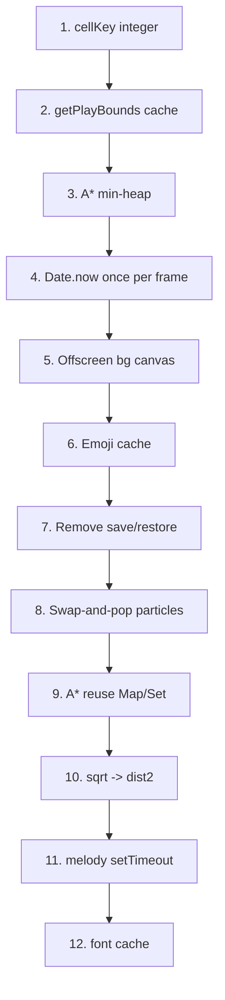

# 🚀 Performance Optimization Plan — Cat Poop Game

> Цель: игра должна идти плавно (60 fps) в любом браузере, сохраняя все механики и тесты.

---

## Приоритеты

| # | Задача | Файл | Выигрыш | Риск |
|---|--------|------|---------|------|
| 1 | A*: заменить линейный поиск min-f на min-heap | `level.js` | 🔴 Критический | Средний |
| 2 | `cellKey`: целочисленный ключ вместо строки | `level.js` | 🔴 Критический | Низкий |
| 3 | `getPlayBounds()`: кэшировать объект, не создавать каждый вызов | `utils.js` | 🔴 Критический | Низкий |
| 4 | Offscreen canvas для фона + статичных препятствий + декора | `renderer.js` | 🟠 Высокий | Средний |
| 5 | `Date.now()` один раз за кадр | `renderer.js`, `entities.js` | 🟠 Высокий | Низкий |
| 6 | Offscreen canvas для emoji-частиц и бонусов | `particles.js`, `bonuses.js`, `projectiles.js` | 🟠 Высокий | Средний |
| 7 | Убрать лишние `ctx.save()/restore()` | `renderer.js`, `entities.js` | 🟠 Высокий | Низкий |
| 8 | Object pool для частиц (вместо splice) | `particles.js`, `projectiles.js` | 🟡 Средний | Низкий |
| 9 | A*: переиспользовать Map/Set (clear вместо new) | `level.js` | 🟡 Средний | Низкий |
| 10 | `Math.sqrt` → squared distance где возможно | `entities.js`, `utils.js` | 🟡 Средний | Низкий |
| 11 | `_melodyTick`: setTimeout вместо rAF | `audio.js` | 🟡 Средний | Низкий |
| 12 | Кэшировать `ctx.font` — не переустанавливать без изменений | `renderer.js` | 🟢 Низкий | Низкий |
| 13 | `hitsObstacles`: пространственное разбиение (grid bucket) | `utils.js` | 🟡 Средний | Средний |

---

## Детальное описание задач

---

### 1. A*: min-heap вместо линейного поиска

**Проблема** ([`js/level.js:125`](../js/level.js:125)):
```js
// Сейчас: O(n) каждую итерацию
for (const node of openSet.values()) {
  if (!current || node.f < current.f) current = node;
}
```
При 600 итерациях и openSet размером ~50 узлов — 30 000 сравнений за один пересчёт пути.

**Решение**: Встроенная бинарная min-heap (MinHeap класс, ~40 строк).
```js
// После: O(log n) на pop и push
const heap = new MinHeap((a, b) => a.f - b.f);
heap.push(startNode);
while (!heap.isEmpty()) {
  const current = heap.pop(); // O(log n)
  ...
  heap.push(neighbor); // O(log n)
}
```
**Ожидаемый выигрыш**: 5–10× ускорение A* (самая дорогая операция в игре).

---

### 2. `cellKey`: целочисленный ключ

**Проблема** ([`js/level.js:22`](../js/level.js:22)):
```js
function cellKey(col, row) { return `${col},${row}`; }
```
Создаёт строку при каждом вызове. Вызывается сотни раз за A* пересчёт.

**Решение**:
```js
function cellKey(col, row) { return col * 100 + row; }
// GRID_ROWS = 13, поэтому col*100+row уникален для col<100, row<100
// Или надёжнее: col * GRID_ROWS + row (при GRID_ROWS=13, col<28 → max=363)
```
Целочисленный ключ в Map/Set в 3–5× быстрее строкового.

**Важно**: `occupiedCells` — это `Set`, `openSet` — `Map`. Оба работают с числами быстрее строк.

---

### 3. `getPlayBounds()`: кэшированный объект

**Проблема** ([`js/utils.js:26`](../js/utils.js:26)):
```js
function getPlayBounds() {
  return { left: ..., top: ..., right: ..., bottom: ... }; // новый объект каждый раз
}
```
Вызывается 10–15 раз за кадр. Каждый вызов — аллокация объекта → GC давление.

**Решение**: Синглтон-объект, обновляемый при изменении размера canvas (которого в игре нет — canvas фиксирован 1200×700).
```js
const _playBounds = {
  left:   WORLD.sidePadding,
  top:    WORLD.topPadding,
  right:  WORLD.width  - WORLD.sidePadding,
  bottom: WORLD.height - WORLD.floorHeight,
};
function getPlayBounds() { return _playBounds; }
```
Canvas размер фиксирован (1200×700), поэтому bounds никогда не меняются.

---

### 4. Offscreen canvas для фона, статичных препятствий и декора

**Проблема** ([`js/renderer.js:123`](../js/renderer.js:123), [`js/renderer.js:76`](../js/renderer.js:76), [`js/renderer.js:461`](../js/renderer.js:461)):
`drawBg()`, `drawDecor()`, и статичные препятствия перерисовываются каждый кадр, хотя меняются только при смене уровня.

**Решение**: Offscreen canvas (статичный слой):
```js
let bgCanvas = null; // OffscreenCanvas или document.createElement('canvas')

function rebuildBgLayer() {
  bgCanvas = document.createElement('canvas');
  bgCanvas.width = canvas.width;
  bgCanvas.height = canvas.height;
  const bctx = bgCanvas.getContext('2d');
  // Рисуем фон, декор, статичные препятствия в bctx
  drawBgTo(bctx);
  drawDecorTo(bctx);
  for (const ob of obstacles) {
    if (!ob.moving) drawObstacleTo(bctx, ob);
  }
}

// В draw():
ctx.drawImage(bgCanvas, 0, 0); // один drawImage вместо сотен операций
// Затем рисуем только движущиеся препятствия поверх
for (const ob of obstacles) {
  if (ob.moving) drawObstacle(ob);
}
```
`rebuildBgLayer()` вызывается только при `generateLevel()`.

**Ожидаемый выигрыш**: 40–60% снижение времени рендеринга за кадр.

---

### 5. `Date.now()` один раз за кадр

**Проблема**: `Date.now()` вызывается 6+ раз за кадр в разных функциях.

**Решение**: Вычислять один раз в начале `draw()` и передавать как параметр или хранить в глобальной переменной `_now`:
```js
let _now = 0; // обновляется в начале draw()

function draw() {
  _now = Date.now();
  // все функции используют _now вместо Date.now()
  ...
}
```

---

### 6. Offscreen canvas для emoji (частицы, бонусы, какашки)

**Проблема**: Emoji-рендеринг через `fillText` — самая медленная операция Canvas 2D. Каждый кадр рисуется до 46 частиц + 3 бонуса + 6 следов какашек.

**Решение**: Pre-render emoji в маленькие offscreen canvas при инициализации:
```js
const _emojiCache = new Map(); // emoji → HTMLCanvasElement

function getEmojiCanvas(emoji, size) {
  const key = `${emoji}_${size}`;
  if (_emojiCache.has(key)) return _emojiCache.get(key);
  const ec = document.createElement('canvas');
  ec.width = ec.height = size + 4;
  const ectx = ec.getContext('2d');
  ectx.font = `${size}px Arial`;
  ectx.textAlign = 'center';
  ectx.textBaseline = 'middle';
  ectx.fillText(emoji, (size+4)/2, (size+4)/2);
  _emojiCache.set(key, ec);
  return ec;
}
```
Затем вместо `ctx.fillText("💩", x, y)` использовать `ctx.drawImage(getEmojiCanvas("💩", 20), x-12, y-12)`.

**Ожидаемый выигрыш**: 3–5× ускорение рендеринга частиц и снарядов.

---

### 7. Убрать лишние `ctx.save()/restore()`

**Проблема**: `save/restore` вызывается для каждого из 12 препятствий, 5 декор-элементов, 46 частиц, 3 бонусов — итого 60+ пар за кадр.

**Решение**: Вместо `save/restore` вручную сбрасывать только изменённые свойства:
- Для `globalAlpha`: сбрасывать в 1 после использования
- Для `translate/rotate/scale`: использовать `setTransform()` вместо save/restore
- Для `shadowBlur`: сбрасывать в 0 явно

```js
// Вместо:
ctx.save(); ctx.translate(x, y); ctx.rotate(r); ... ctx.restore();

// Использовать:
ctx.setTransform(cos*sc, sin*sc, -sin*sc, cos*sc, x, y);
... // рисуем
ctx.setTransform(1, 0, 0, 1, 0, 0); // сброс
```

---

### 8. Object pool для частиц

**Проблема** ([`js/particles.js:57`](../js/particles.js:57)):
```js
overlayParticles.splice(i, 1); // O(n) сдвиг массива
```

**Решение**: Swap-and-pop (O(1)) или пул объектов:
```js
// Swap-and-pop вместо splice:
overlayParticles[i] = overlayParticles[overlayParticles.length - 1];
overlayParticles.pop();
```
Порядок частиц не важен для визуала.

---

### 9. A*: переиспользовать Map/Set

**Проблема** ([`js/level.js:113`](../js/level.js:113)):
```js
const openSet = new Map();
const closedSet = new Set();
```
Создаются заново каждые 30 кадров.

**Решение**: Хранить как поля объекта `owner` и вызывать `.clear()`:
```js
// В owner:
_astarOpen: new Map(),
_astarClosed: new Set(),

// В aStarPath:
owner._astarOpen.clear();
owner._astarClosed.clear();
```

---

### 10. `Math.sqrt` → squared distance

**Проблема** ([`js/entities.js:364`](../js/entities.js:364)):
```js
const dist = Math.sqrt(dx*dx + dy*dy);
if (dist < spd + 2) { ... }
```

**Решение**:
```js
const dist2 = dx*dx + dy*dy;
const threshold = spd + 2;
if (dist2 < threshold * threshold) { ... }
// Если нужен нормализованный вектор — sqrt только тогда
const dist = Math.sqrt(dist2);
dx /= dist; dy /= dist;
```
Применимо в `_moveTowardTarget` (dist < spd+2), `owner.update` (movedDist < 0.5), `owner.flee` (dist > 2).

---

### 11. `_melodyTick`: setTimeout вместо rAF

**Проблема** ([`js/audio.js:232`](../js/audio.js:232)):
```js
_melodyRAF = requestAnimationFrame(_melodyTick);
```
Планировщик мелодии запускается 60 раз в секунду, хотя нужно проверять ~2 раза в секунду (lookahead ~1 итерация = ~14 сек).

**Решение**:
```js
_melodyTimeout = setTimeout(_melodyTick, 500); // проверяем каждые 500мс
```
Освобождает rAF бюджет для рендеринга.

---

### 12. Кэшировать `ctx.font`

**Проблема**: `ctx.font = "20px Arial"` устанавливается многократно за кадр, даже если значение не изменилось. Парсинг font-строки — дорогая операция.

**Решение**: Обёртка с кэшем:
```js
let _currentFont = '';
function setFont(f) {
  if (f !== _currentFont) { ctx.font = f; _currentFont = f; }
}
```

---

### 13. `hitsObstacles`: пространственное разбиение

**Проблема** ([`js/utils.js:47`](../js/utils.js:47)):
```js
return obstacles.some(o => o.id !== ignId && rectsOverlap(rect, o));
```
Проверяет все препятствия (до 12). Вызывается сотни раз за A* пересчёт.

**Решение**: Разбить игровое поле на крупные ячейки (например, 4×4 зоны) и хранить список препятствий в каждой зоне. При проверке коллизии — смотреть только в соседних зонах.

Однако при 12 препятствиях выигрыш небольшой. Приоритет ниже, чем задачи 1–3.

---

## Что НЕ меняем

- Все игровые механики (срочность, паника, комбо, бонусы, A*, flee)
- Все константы в `config.js` (DIFF, WORLD, BONUS_TYPES, obstacleCatalog)
- Все публичные функции и глобальные переменные (совместимость с тестами)
- Порядок загрузки модулей в `index.html`
- Vanilla JS — никаких фреймворков

---

## Порядок реализации



---

## Тестирование после изменений

После каждой группы изменений:
```bash
npm test  # должно быть 224 passed, 0 failed
```

Визуальная проверка в браузере:
- Все механики работают (паника, комбо, бонусы, A*, flee)
- Фон корректно перерисовывается при смене уровня
- Частицы и бонусы отображаются корректно
- Мелодия играет без разрывов
