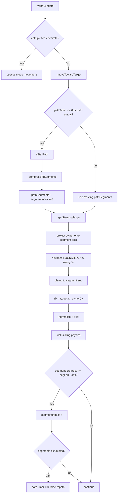

# Steering Corridor Plan — Owner AI Refactor
## Cat Poop Game — Basement AI Stabilization

> **Status:** Planning
> **Scope:** `js/owner.js`, `js/renderer.js`, `tests/owner-steering.test.js`, `ARCHITECTURE.md`
> **Tests before:** 458 passed
> **Goal:** Zero regressions + better basement movement

---

## Critical Review of the GPT Plan

The GPT plan is directionally correct but contains several proposals that would **break working code**. This plan implements only what's genuinely useful.

### What we keep from the GPT plan ✅

- **Steering target projection** (`_getSteeringTarget`) — the core fix
- **Segment-based path compression** (`_compressToSegments`) — gives stable corridor axes
- **Segment-progress completion** — replaces fragile distance threshold
- **Remove `stuckNudge`** — random nudge is noise when steering works
- **Remove duplicate-skip `while` loop** — fragile, replaced by segment model
- **Debug overlay Shift+G** — useful for tuning
- **New test file** — required by project rules

### What we reject from the GPT plan ❌

| GPT Proposal | Why Rejected |
|---|---|
| Delete `pathW/pathH` basement override | This is a **correct fix**, not a hack. Owner (36×52) can't fit 1-cell corridors; using player.size (36×36) for A* is architecturally correct and documented in ARCHITECTURE.md |
| "Always use 36×36 footprint" | Wrong for open levels — 36×52 is the correct physical size there |
| Remove `if (basementMode !== "")` smoothing guard | Smoothing on open levels causes different problems; guard stays |
| Unify repath to 30/18 hardcoded | Already correct: 30 frames open, 15 frames basement. No change needed |
| Remove `pathTimer = 0` on empty path | This prevents hanging in direct-movement mode near walls — keep it |
| Remove `if (this.path.length <= 1) pathTimer = 0` | Same — keep it |

---

## Architecture: Current vs Target

### Current flow

```
A* → path[{col,row},...] → aim at cellToPixelCenter(path[1]) → collision resolution
```

Problem: wall-sliding changes physical position → owner misses exact cell center → `path.shift()` never fires → oscillation / corner freeze.

### Target flow

```
A* → _compressToSegments() → [{start,end,dir},...] → _getSteeringTarget() → collision resolution
```

Owner no longer aims at a point. It steers **along the corridor axis**, with the target projected `LOOKAHEAD` px ahead on the current segment. Wall-sliding is compatible with this because the segment axis is stable regardless of lateral drift.

---

## Data Model

### New state on `owner`

```js
owner.pathSegments = [];   // [{startPx:{x,y}, endPx:{x,y}, dir:{x,y}}, ...]
owner.segmentIndex = 0;    // current active segment
```

`path` array is kept for compatibility with existing tests and the `draw()` sign logic (`this.path.length >= 2`).

### Segment structure

```js
{
  startPx: { x, y },   // pixel center of first cell in segment
  endPx:   { x, y },   // pixel center of last cell in segment
  dir:     { x, y },   // normalized direction (one of ±{1,0} or ±{0,1})
}
```

---

## Implementation Details

### Step 1 — `_compressToSegments(path)`

Called after A* returns a new path (replaces `_smoothPath` call site, but `_smoothPath` is kept for backward compat with existing tests).

```
Input:  [{col,row}, {col,row}, ...]   (raw A* output, ≥1 nodes)
Output: [{startPx, endPx, dir}, ...]  (one segment per straight run)
```

Algorithm:
1. Convert each cell to pixel center via `cellToPixelCenter(col, row)`
2. Walk the path; while direction is the same, extend current segment
3. On direction change, close current segment and start new one
4. Store in `this.pathSegments`; reset `this.segmentIndex = 0`

Edge cases:
- Path length 0 or 1 → `pathSegments = []`
- Single-cell path → one zero-length segment (handled gracefully)

### Step 2 — `_getSteeringTarget()`

```js
const LOOKAHEAD = GRID * 0.8; // 32px
```

Algorithm:
1. Get active segment: `seg = this.pathSegments[this.segmentIndex]`
2. If no segment → fall back to direct movement toward `fleeTarget` / player
3. Compute owner center: `ownerCx, ownerCy`
4. Project owner center onto segment line:
   ```
   t = dot(ownerCenter - seg.startPx, seg.dir)
   projected = seg.startPx + t * seg.dir
   ```
5. Advance target: `target = projected + seg.dir * LOOKAHEAD`
6. Clamp target to segment end (don't overshoot)
7. Return `{x, y}`

### Step 3 — Segment Completion Check

Replace:
```js
const threshold = spd + 2;
if (dist2 < threshold * threshold) { this.path.shift(); ... }
```

With:
```js
// Progress along segment axis
const seg = this.pathSegments[this.segmentIndex];
const progress = dot(ownerCenter - seg.startPx, seg.dir);
const segLen = dot(seg.endPx - seg.startPx, seg.dir);
const EPSILON = 4; // px
if (progress >= segLen - EPSILON) {
  this.segmentIndex++;
  // Also advance path[] to keep sign logic working
  this.path.shift();
}
```

When `segmentIndex >= pathSegments.length`:
- Segments exhausted → `pathTimer = 0` (force repath next frame)

### Step 4 — Replace Movement Target

In `_moveTowardTarget()`, replace:
```js
const nextCell = this.path[1];
const nextPx = cellToPixelCenter(nextCell.col, nextCell.row);
dx = nextPx.x - ownerCx;
dy = nextPx.y - ownerCy;
```

With:
```js
const target = this._getSteeringTarget();
dx = target.x - ownerCx;
dy = target.y - ownerCy;
```

Then normalize and apply existing wall-sliding physics unchanged.

### Step 5 — Remove `stuckNudge`

Delete:
```js
this.stuckNudge = nudges[Math.floor(Math.random() * nudges.length)];
```

And the application block:
```js
if (this.stuckNudge) { ... }
```

Keep:
```js
if (this.stuckTimer > 45) {  // raised from 30 to 45 — steering needs more time
  this.path = [];
  this.pathSegments = [];
  this.pathTimer = 0;
  this.stuckTimer = 0;
}
```

Rationale: steering eliminates corner deadlocks. Random nudge was compensating for the old threshold model. With steering, nudge becomes noise that can push the owner into walls.

### Step 6 — Remove Duplicate-Skip Loop

Delete:
```js
while (this.path.length >= 2) {
  const newNext = this.path[1];
  if (newNext.col === ownerCell.col && newNext.row === ownerCell.row) {
    this.path.shift();
    continue;
  }
  ...
  break;
}
```

Rationale: segment model never produces duplicate waypoints — A* doesn't emit them, and `_compressToSegments` merges consecutive same-direction cells.

### Step 7 — Debug Overlay (Shift+G)

In `js/renderer.js`, add to the `draw()` function (guarded by a flag):

```js
let _debugSteering = false;
// In input handler: if (e.key === 'G' && e.shiftKey) _debugSteering = !_debugSteering;
```

Draw (after main scene, before HUD):
```
Red dots:    raw A* path cells
Yellow lines: compressed segments
Cyan dot:    steering target point
Green dot:   owner center projection on segment
```

Toggle: `Shift+G` (EN layout). Dev-only, no impact on gameplay.

---

## What Changes in `owner` State

| Field | Before | After |
|---|---|---|
| `path` | `[{col,row},...]` waypoints | Kept — used for sign logic and repath trigger |
| `pathSegments` | — | New: `[{startPx,endPx,dir},...]` |
| `segmentIndex` | — | New: index into `pathSegments` |
| `stuckNudge` | Random nudge vector | **Removed** |
| `stuckTimer` threshold | 30 frames | 45 frames (steering needs more time) |

---

## What Does NOT Change

- A* algorithm (`pathfinding.js`) — untouched
- `pathW/pathH` basement override — kept (correct fix)
- `_smoothPath` — kept (existing tests cover it; called in basement after compress)
- `_hasLineOfSight` — kept
- Repath intervals: 30 frames open, 15 frames basement — unchanged
- `pathTimer = 0` on empty path — kept
- Wall-sliding physics — untouched
- `flee()`, `catnip`, `hesitateTimer`, `driftAngle` — untouched
- All existing `owner.test.js` tests — must pass without modification

---

## New Test File: `tests/owner-steering.test.js`

### Test cases

#### 1. Straight corridor — owner reaches end
```
Setup: 8-cell horizontal corridor, no obstacles
Owner at left end, player at right end
Run 200 frames
Assert: owner.x > startX + 200px (made significant progress)
Assert: pathTimer never exceeded 15 (no repath spam)
```

#### 2. 90° turn — clean turn, no oscillation
```
Setup: L-shaped path (right 4 cells, then down 4 cells)
Mark cells to force A* through the L
Run 120 frames
Assert: owner reaches vicinity of corner (within 2 cells)
Assert: stuckTimer never exceeded 10 (no fake stuck)
```

#### 3. Narrow basement corridor — no stuck
```
Setup: basementMode = "corridor", 2-cell-wide corridor
Owner at one end, player at other
Run 150 frames
Assert: owner moved > 100px toward player
Assert: stuckTimer < 45 (never triggered force-repath)
```

#### 4. Dynamic obstacle forces repath
```
Setup: clear path, owner moving
After 30 frames: add obstacle blocking current segment
Assert: within 20 frames, pathSegments is recomputed (segmentIndex reset)
Assert: owner finds alternate route (x/y changes direction)
```

#### 5. Rapid cat movement — steering stable
```
Setup: player moves 200px every 10 frames (teleport)
Run 100 frames
Assert: owner.facingX/Y always unit vector (no NaN, no length > 1.01)
Assert: no stuckTimer overflow
```

#### 6. `_compressToSegments` — straight path compresses to 1 segment
```
Input: [{col:2,row:5},{col:3,row:5},{col:4,row:5},{col:5,row:5}]
Assert: pathSegments.length === 1
Assert: pathSegments[0].dir ≈ {x:1, y:0}
```

#### 7. `_compressToSegments` — L-path compresses to 2 segments
```
Input: [{col:2,row:5},{col:3,row:5},{col:3,row:6},{col:3,row:7}]
Assert: pathSegments.length === 2
Assert: pathSegments[0].dir ≈ {x:1, y:0}
Assert: pathSegments[1].dir ≈ {x:0, y:1}
```

#### 8. `_getSteeringTarget` — target is ahead on segment
```
Setup: single horizontal segment from x=100 to x=300
Owner center at x=150
Assert: target.x > 150 (ahead, not behind)
Assert: target.x ≤ 300 (clamped to segment end)
```

#### 9. Segment completion — advances on progress
```
Setup: owner at 95% progress along segment (segLen - 3px)
Call _moveTowardTarget one frame
Assert: segmentIndex incremented
```

#### 10. No stuckNudge property after refactor
```
Assert: owner.stuckNudge === undefined (property removed)
```

---

## Files Changed

| File | Change |
|---|---|
| `js/owner.js` | Add `pathSegments`, `segmentIndex`; add `_compressToSegments()`, `_getSteeringTarget()`; refactor `_moveTowardTarget()`; remove `stuckNudge` |
| `js/renderer.js` | Add `_debugSteering` flag + Shift+G overlay draw |
| `tests/owner-steering.test.js` | New file — 10 test cases |
| `ARCHITECTURE.md` | Update A* navigation section with steering model |

---

## Success Criteria

- All 458 existing tests pass (zero regressions)
- New 10 steering tests pass
- `_moveTowardTarget()` is shorter (target: -20% lines)
- `stuckNudge` is gone
- Duplicate-skip `while` loop is gone
- Basement AI moves smoothly through corridors without corner freeze
- Code does NOT get larger overall (GPT's own criterion)

---

## Mermaid: New Movement Flow



---

## Notes for Implementation

1. `_compressToSegments` must handle the edge case where A* returns a 1-node path (owner already at goal) — produce empty segments, trigger immediate repath.

2. `_getSteeringTarget` fallback when `pathSegments` is empty: use direct vector to `(tx, ty)` — same as current `else` branch in `_moveTowardTarget`.

3. The `path` array is still maintained in parallel (shifted when `segmentIndex` advances) so that `draw()` sign logic (`this.path.length >= 2` → show `!`) continues to work without changes.

4. `activate()` must reset both `pathSegments = []` and `segmentIndex = 0`.

5. `flee()` uses `_moveTowardTarget` internally — steering applies there too, which is fine (flee target is a corner, A* will find a path to it).

6. The debug overlay must be toggled by `Shift+G` in the keyboard handler in `game.js`, not `renderer.js` (renderer only reads the flag).
